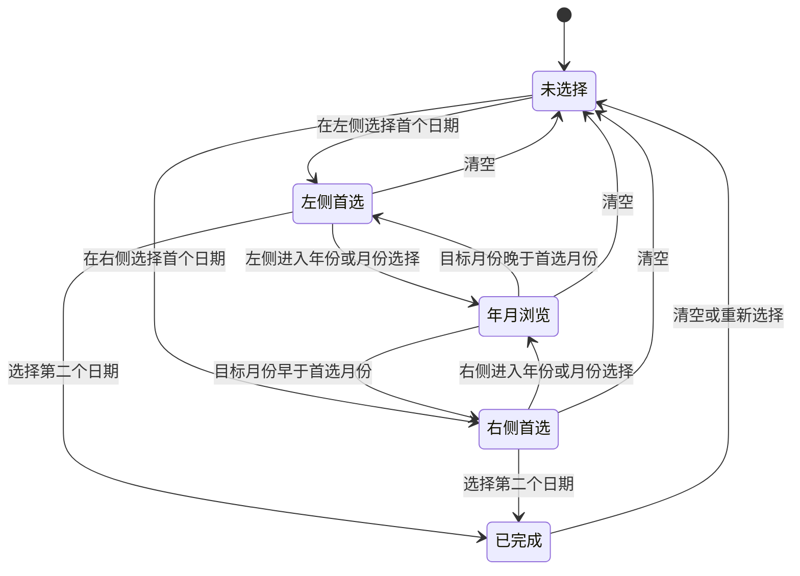

# FormDateBox 日期组件使用与交互流程

本文档说明 `src/components/form/FormDateBox/index.vue` 的当前使用方式、值契约、日期范围选择流程、双面板联动规则和边界处理。组件基于 View UI Plus `DatePicker` 封装，项目页面应优先使用本组件，不在业务页面重复实现日期选择逻辑。

## 1. 适用场景

`FormDateBox` 主要支持两类场景：

| 场景 | `type` | 推荐值格式 |
| --- | --- | --- |
| 单日期 | `date` | `yyyy-MM-dd` 字符串 |
| 日期范围 | `daterange` | `[startDate, endDate]` 数组 |

项目中的典型调用包括：

- 表格和页面筛选：通过 `data + startKey + endKey` 直接绑定查询对象。
- 普通表单：通过 `v-model` 绑定单日期或日期范围。
- 动态认证表单：通过 `isSring` 兼容逗号分隔的旧字符串格式。
- 卡片、财务和邀请记录：通过 `maxMonths` 控制首个日期选中后的最大可选跨度。

组件事实入口：

```text
src/components/form/FormDateBox/index.vue
```

## 2. 基础使用

### 2.1 单日期

```vue
<FormDateBox
  v-model="form.expireDate"
  type="date"
  :options="dateOptions"
/>
```

单日期选中后输出：

```js
form.expireDate = '2026-07-31'
```

清空后输出空字符串：

```js
form.expireDate = ''
```

### 2.2 日期范围数组

```vue
<FormDateBox
  v-model="dateRange"
  type="daterange"
  :maxMonths="3"
  @on-change="handleChange"
/>
```

日期范围选中后输出：

```js
dateRange.value = ['2026-05-01', '2026-07-31']
```

清空后输出空数组：

```js
dateRange.value = []
```

### 2.3 直接绑定查询对象

```vue
<FormDateBox
  :data="search"
  startKey="startTime"
  endKey="endTime"
  type="daterange"
  :maxMonths="3"
/>
```

组件会直接维护：

```js
search.startTime = '2026-05-01'
search.endTime = '2026-07-31'
```

如果不传 `startKey` 和 `endKey`，默认字段为：

```text
startTime
endTime
```

### 2.4 兼容逗号分隔字符串

`isSring` 是现有历史属性名，拼写必须保持不变。

```vue
<FormDateBox
  v-model="fieldValue"
  type="daterange"
  :isSring="true"
/>
```

输入和输出格式：

```js
fieldValue.value = '2026-05-01,2026-07-31'
```

未启用 `isSring` 时，组件仍可读取以下两种历史范围字符串，并在后续写入时按正常数组契约输出：

```text
2026-05-01,2026-07-31
2026-05-01 ~ 2026-07-31
```

## 3. Props 与事件

### 3.1 组件 Props

| Prop | 类型 | 默认值 | 说明 |
| --- | --- | --- | --- |
| `modelValue` | `Array / Object / String / null` | - | `v-model` 值 |
| `defaultDate` | 任意有效日期值 | - | 单日期面板初始定位日期，不代表已经选中 |
| `data` | `Object` | - | 直接绑定范围查询对象 |
| `startKey` | `String` | `startTime` | `data` 中的开始日期字段 |
| `endKey` | `String` | `endTime` | `data` 中的结束日期字段 |
| `width` | `String / Number` | `100%` | 数字自动转换为 `px` |
| `type` | `String` | `daterange` | 当前主要使用 `date`、`daterange` |
| `disableAfterToday` | `Boolean` | `true` | 是否禁用当前业务时区今天之后的日期 |
| `notDateOptions` | `Boolean` | `false` | 是否隐藏日期范围快捷项 |
| `isSring` | `Boolean` | `false` | 是否以逗号分隔字符串读写日期范围 |
| `maxMonths` | `Number` | `0` | 首个日期选中后允许继续选择的最大月份跨度；`0` 表示不启用该限制 |

### 3.2 透传属性

除上述 Props 外，组件会把 `$attrs` 透传给 View UI Plus `DatePicker`。常用属性包括：

```vue
<FormDateBox
  size="default"
  placement="bottom-end"
  :clearable="false"
  placeholder="请选择日期"
  :options="dateOptions"
/>
```

调用方传入的 `placeholder`、`format`、`start-date` 等顶层属性可以覆盖组件默认值。

`options.disabledDate` 不会覆盖组件内部限制，而是与内部限制合并。

### 3.3 事件

| 事件 | 参数 | 说明 |
| --- | --- | --- |
| `update:modelValue` | 格式化后的值 | 用于 `v-model` |
| `on-change` | DatePicker 当前变更值 | 选择或清空后触发 |

业务请求通常监听 `on-change`：

```vue
<FormDateBox
  v-model="dateRange"
  @on-change="reloadList"
/>
```

## 4. 日期范围主流程



核心原则：

1. 没有选中首个日期时，不使用 `maxMonths` 限制年月浏览。
2. 首个日期可以在左侧或右侧面板选择。
3. 选中首个日期后，组件才根据 `maxMonths`、今天边界和调用方禁用日期收紧可选范围。
4. 日期层的左右面板始终保持不同月份，不允许显示同一个月。
5. 年月浏览阶段，首个日期固定显示在当前操作面板的反方向，目标年月暂不按左右位置定向。
6. 只有选择具体月份并返回日期层时，才根据目标月份早于或晚于首选月份决定左右位置。
7. 不可选择的日期、月份、年份和翻页按钮保持可见，但使用禁用状态，并在点击时再次拦截。
8. 最终开始和结束日期由 DatePicker 形成；调用方不应根据用户先点击左侧还是右侧推断字段顺序。

## 5. `maxMonths` 边界规则

### 5.1 生效时机

`maxMonths` 只在日期范围已经选中首个日期、正在等待第二个日期时生效。

例如：

```vue
<FormDateBox type="daterange" :maxMonths="3"/>
```

在选择首个日期之前：

- 可以向过去浏览任意年月。
- `disableAfterToday=true` 时不能浏览到全部日期都在未来的月份。
- 调用方 `disabledDate` 仍然生效。

选择首个日期之后：

- 第二个日期必须在首个日期前后 `3` 个月范围内。
- 左右面板的月份距离不能超过 `3` 个月。
- 月份内没有任何可选日期时，该月份和对应翻页入口禁用。

### 5.2 `maxMonths=1`

自然月天数不固定。为避免“一个月”产生 31 天跨度，`maxMonths=1` 会额外限制为首个日期前后最多 30 天。

### 5.3 与今天边界组合

当 `disableAfterToday=true`：

- 最大日期不会超过当前业务时区的今天。
- 未来日期禁用。
- 未来月份如果没有可选日期，对应月份、年份入口或翻页按钮禁用。

当前日期使用项目偏好设置中的业务时区计算，不直接依赖浏览器本地时区。

## 6. 左右面板规则

### 6.1 首个日期在左侧

假设左侧选择 `2026-09-15`：

- 左侧保留首选日期所在的 9 月。
- 右侧首先定位到 10 月。
- 点击左侧下一月时，左侧不动，右侧依次进入 11 月、12 月，直到禁用边界。
- 右侧可以向前返回，但最多回到 10 月，不能与左侧同为 9 月。
- 点击左侧上一月时，左侧进入 8 月，首选日期所在的 9 月转移到右侧；此后可以继续向更早月份浏览。

### 6.2 首个日期在右侧

- 右侧保留首选日期所在月。
- 左侧首先定位到首选日期的上一个月。
- 点击右侧上一月时，右侧不动，左侧依次向更早月份移动，直到禁用边界。
- 左侧可以向后返回，但不能与右侧显示同一个月。
- 点击右侧下一月时，右侧进入更晚月份，首选日期所在月转移到左侧。

### 6.3 年月浏览阶段

进入年份或月份选择时，首个日期必须始终显示在操作面板的反方向：

- 左侧进入年月选择：右侧强制恢复为日期表，显示并高亮首个日期；左侧用于浏览年月。
- 右侧进入年月选择：左侧强制恢复为日期表，显示并高亮首个日期；右侧用于浏览年月。
- 年月浏览阶段不根据操作面板是左侧还是右侧提前限制目标方向。
- 操作面板可以浏览首选日期之前或之后的全部合法年月。
- `maxMonths`、`maxMonths=1` 的 30 天保护、今天边界和调用方 `disabledDate` 仍然生效。
- 年月浏览期间允许操作面板的年月在视觉顺序上跨过首选月份，因为此时尚未确定最终日期层左右位置。

### 6.4 选择月份后重新定位

只有用户选择具体月份、准备返回日期层时，组件才比较目标月份和首选月份：

| 目标月份 | 左侧日期表 | 右侧日期表 |
| --- | --- | --- |
| 早于首选月份 | 目标月份，等待选择第二个日期 | 首选月份，保留首个日期 |
| 晚于首选月份 | 首选月份，保留首个日期 | 目标月份，等待选择第二个日期 |
| 等于首选月份 | 当前操作侧保留首选月份 | 另一侧调整为相邻合法月份 |

例如左侧先选择 `2026-06-11`，再从左侧进入年月选择并选择 2 月：

1. 年月浏览时，`2026-06-11` 显示在右侧日期表。
2. 左侧可以浏览首选日期前后的合法年月。
3. 选择 2 月后，因为 2 月早于 6 月，左侧返回 2 月日期表，右侧继续显示并高亮 `2026-06-11`。
4. 用户在左侧选择 2 月具体日期后，组件输出按时间先后排序的完整范围。

右侧操作完全对称。例如右侧先选 6 月，再从右侧选择 10 月，最终左侧显示首选的 6 月，右侧显示待选的 10 月。

### 6.5 相邻月份没有可选日期

- 首选日期所在月的一侧没有可选日期，而另一侧仍有可选日期时，组件自动把首选月份放到另一面板，优先保留可继续选择的方向。
- 首选月份前后相邻月份都没有可选日期时，首选月份仍可选择同月内的第二个日期，另一面板保持禁用状态。
- 不会为了维持相邻月份展示而绕过 `maxMonths`、今天边界或调用方 `disabledDate`。

## 7. 日期、月份、年份和按钮禁用

组件按以下顺序综合判断：

```text
组件内部 maxMonths 范围
OR disableAfterToday 今天边界
OR 调用方 options.disabledDate
OR 左右面板顺序和最大月份距离
OR 目标月份不存在任何可选日期
```

### 7.1 调用方禁用日期

```vue
<FormDateBox
  v-model="dateRange"
  type="daterange"
  :options="{
    disabledDate(date) {
      return date.getDay() === 0
    }
  }"
/>
```

最终禁用结果为：

```text
组件内部禁用规则 OR 调用方 disabledDate
```

调用方规则不会绕过未来日期或 `maxMonths`。

### 7.2 月份禁用

月份满足任一条件时禁用：

- 超出首选日期允许的总月份范围。
- 该月每一天都被最终 `disabledDate` 禁用。
- 返回日期层后无法形成合法的左右面板顺序。

年月浏览阶段不因为目标月份位于首选月份的另一方向而禁用；月份确认后由组件重新决定左右位置。

### 7.3 年份禁用

- 年份内没有任何合法月份时禁用。
- 当前面板所在年份允许进入月份视图，再由月份层展示具体可选范围。
- 可选年份和月份使用主蓝色，禁用项使用浅灰色。

### 7.4 翻页按钮禁用

月份和年份翻页按钮在以下情况禁用：

- 日期层的目标月份没有可选日期，或会超出合法左右顺序。
- 月份层的目标年份内没有任何可选月份。
- 年份层的目标十年内没有任何可选月份。
- 翻页后超过 `maxMonths`、30 天保护或今天边界。
- 联动后的另一个日期面板落在全部日期禁用的月份。

禁用按钮保留在原位置，避免界面操作入口忽隐忽现。按钮显示状态和点击处理使用相同的目标范围，并在点击时再次校验，不能仅依赖灰色样式阻止越界。

## 8. 快捷项

默认基础快捷项：

```text
今天
昨天
本周
本月
上月
```

### 8.1 未设置 `maxMonths`

额外显示：

```text
近3个月
近6个月
近1年
```

### 8.2 设置 `maxMonths`

组件根据最大月份动态添加：

- “近30天”，包含今天在内共 30 个自然日。
- 小于最大范围的标准“近 N 个月”（从 3 个月开始）。
- 当前 `maxMonths` 对应的最大快捷项。

### 8.3 范围移动

“范围前移”和“范围后移”始终显示，不受 `maxMonths` 是否设置或具体数值影响。`maxMonths` 只控制日期选择跨度和“近 N 个月”快捷项。

“范围前移”和“范围后移”必须在当前已选择完整日期范围时才可用。移动天数按 `结束日期 - 开始日期 + 1` 计算，包含首尾两天：

- 范围前移：按完整天数整体向前移动，例如 `3日～3日` 移为 `2日～2日`，`3日～4日` 移为 `1日～2日`。
- 范围后移：正常按完整天数整体向后移动；如果今天之前的剩余日期不足一个完整区间，则从原结束日的下一天开始，结束日截到今天。

“范围后移”在当前结束日期已经是今天时保持显示但禁用。

例如当前范围是 `7月19日～7月29日`、今天是 `8月3日`，范围后移后为 `7月30日～8月3日`。

所有快捷选择都会先恢复左右面板为日期表，避免面板停留在月份或年份视图。

## 9. 打开、关闭和移动端行为

### 9.1 打开面板

打开时组件会：

- 日期范围值为空时，先恢复初始相邻月份、日期表和未选择状态。
- 安装左右面板日期和选择状态监听。
- 校正左右面板月份。
- 同步翻页、月份、年份和快捷项禁用状态。
- 给输入框和快捷项补充完整文本 `title`。

### 9.2 关闭面板

关闭时左右面板统一恢复为日期表。

因此用户在月份或年份视图直接关闭后，再次打开不会停留在上一次的年月选择界面。

### 9.3 清空范围

点击组件清空按钮或由调用方清空 `v-model`、`data` 字段、`isSring` 字符串后，组件统一恢复初始状态：

- 清除首个日期和等待第二个日期的范围状态。
- 左右面板恢复为初始相邻月份。
- 左右面板均恢复为日期表。
- 清除首选日期形成的临时联动范围，并重新同步所有禁用状态。
- 下次选择按首次打开组件的流程重新开始。

### 9.4 移动端

移动端行为：

- 日期输入框设置 `readonly` 和 `inputmode="none"`，点击时不弹出系统键盘。
- 日期范围的左右日历上下排列。
- 快捷项区域适配移动端宽度。
- 输入值过长时单行省略，并通过 `title` 保留完整文本。

## 10. 页面筛选配置方式

`UiPage`、`UiFormItem` 等配置式筛选会把日期配置透传给 `FormDateBox`。

```js
const searchThead = [
  {
    label: t('card.index.bills.transactionTime'),
    type: 'daterange',
    startKey: 'startTime',
    endKey: 'endTime',
    maxMonths: 3,
    clearable: false,
    width: 230,
  },
]
```

对应查询对象：

```js
const search = {
  startTime: '',
  endTime: '',
}
```

当前常见范围：

| 页面或组件 | `maxMonths` |
| --- | ---: |
| 卡片账单 | `3` |
| 用户财务流水 | `6` |
| Recharge 记录 | `1` |
| Withdrawal 记录 | `1` |
| 邀请记录 | `1` |
| `TabsDayBox` | `1` |

业务页面应根据接口查询限制设置 `maxMonths`，不要统一复制其他页面的值。

## 11. 接入注意事项

### 11.1 不要同时混用值模式

同一个实例只选择一种方式：

- `v-model` 数组。
- `v-model + isSring` 字符串。
- `data + startKey + endKey` 对象字段。

不要同时传 `data` 和依赖 `v-model` 保存范围值，因为 `data` 模式优先。

### 11.2 不要覆盖内部禁用流程

业务禁用日期统一放在：

```vue
:options="{ disabledDate }"
```

不要在页面中操作 DatePicker 内部面板实例，也不要直接修改组件生成的禁用 class。

### 11.3 不要把 `maxMonths` 当作固定天数

除 `maxMonths=1` 的 30 天保护外，组件按自然月计算边界，不等同于：

```text
maxMonths × 30 天
```

### 11.4 修改共享组件时检查调用方

修改 `FormDateBox` 前至少检查：

```text
src/components/form/FormTable/FormItemType.vue
src/components/uiForm/UiFormItem/index.vue
src/components/com/TabsDayBox.vue
src/views/card
src/views/ucenter/finance
src/views/ucenter/invite
src/views/certify
src/views/ucenter/account
```

## 12. 验证清单

修改日期组件后，至少覆盖以下场景：

### 值格式

- 单日期选择和清空分别输出字符串和空字符串。
- 日期范围选择和清空分别输出数组和空数组。
- `isSring` 正常读写逗号字符串。
- 历史逗号或 `~` 分隔范围字符串能够正常打开。
- `data` 模式正确更新两个目标字段。

### 范围流程

- 未选择首个日期时可以浏览过去的年月。
- 左侧选择首个日期后，右侧先显示下一个月；继续操作左侧下一月时，右侧按月连续前进。
- 右侧选择首个日期后，左侧先显示上一个月；继续操作右侧上一月时，左侧按月连续后退。
- 从首选日期月份向另一方向浏览时，首选日期正确转移到另一面板。
- 首个日期选中后，左右面板不会显示同一个月。
- 向前浏览后可以反向返回，不会被永久锁死。
- `maxMonths=1`、`3`、`6` 的边界符合对应业务要求。

### 禁用边界

- `disableAfterToday=true` 时未来日期、月份和翻页入口禁用。
- `disableAfterToday=false` 时不错误限制未来年月。
- 调用方 `disabledDate` 与内部限制同时生效。
- 整月日期被禁用时，对应月份和翻页入口禁用。
- 可选年月为主蓝色，禁用年月为浅灰色。

### 年月与面板

- 左右面板可以分别切换年月。
- 点击当前年份可以进入范围内月份。
- 左侧进入年月选择时，首个日期显示并高亮在右侧日期表；右侧操作时反向验证。
- 年月浏览阶段可以选择首选日期之前或之后的合法年月，不受操作面板方向限制。
- 选择月份后根据目标月份早于或晚于首选月份重新排列左右日期表。
- 左侧首选 `2026-06-11` 后从左侧选择 2 月，最终左侧显示 2 月、右侧显示并高亮 `2026-06-11`。
- 右侧首选 6 月后从右侧选择 10 月，最终左侧显示并高亮首选日期、右侧显示 10 月。
- 禁用月份、年份、上一年、下一年、上十年和下十年在点击时均不能绕过范围。
- 快捷选择或关闭后重新打开，左右两侧均为日期表。
- 清空按钮、外部 `v-model`、`data` 模式和 `isSring` 模式清空后均恢复初始相邻月份和日期表。

### 移动端

- 输入框聚焦时不弹出系统键盘。
- 双日历上下排列且不产生横向溢出。
- 快捷项和禁用状态可见、可理解。

普通局部修改按项目测试规范执行静态或组件级检查；用户要求提交或更新 PR 时，再基于最终代码完成构建和浏览器验收。
