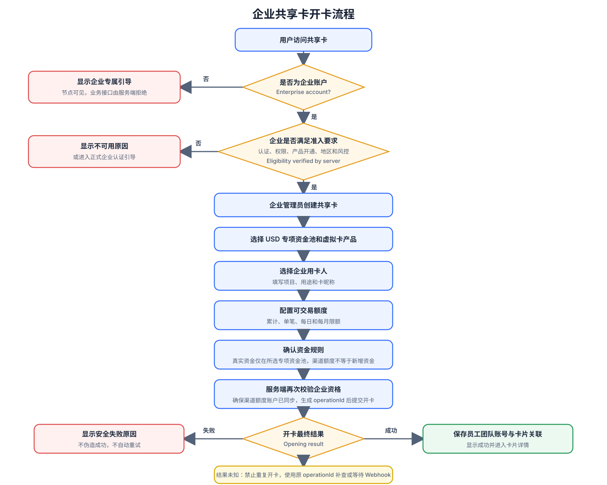
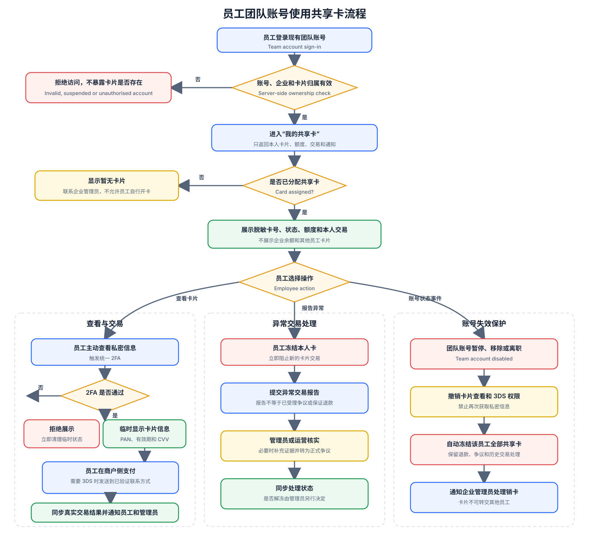
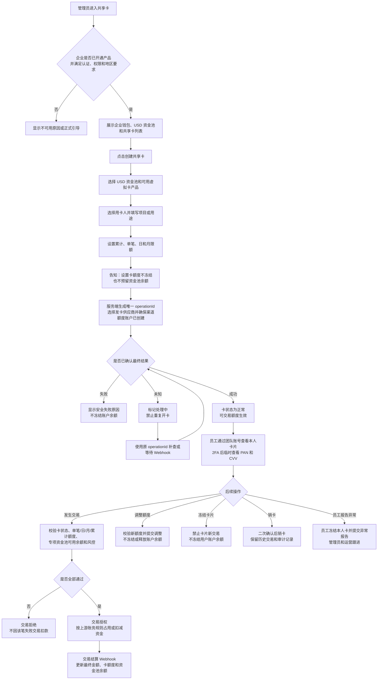
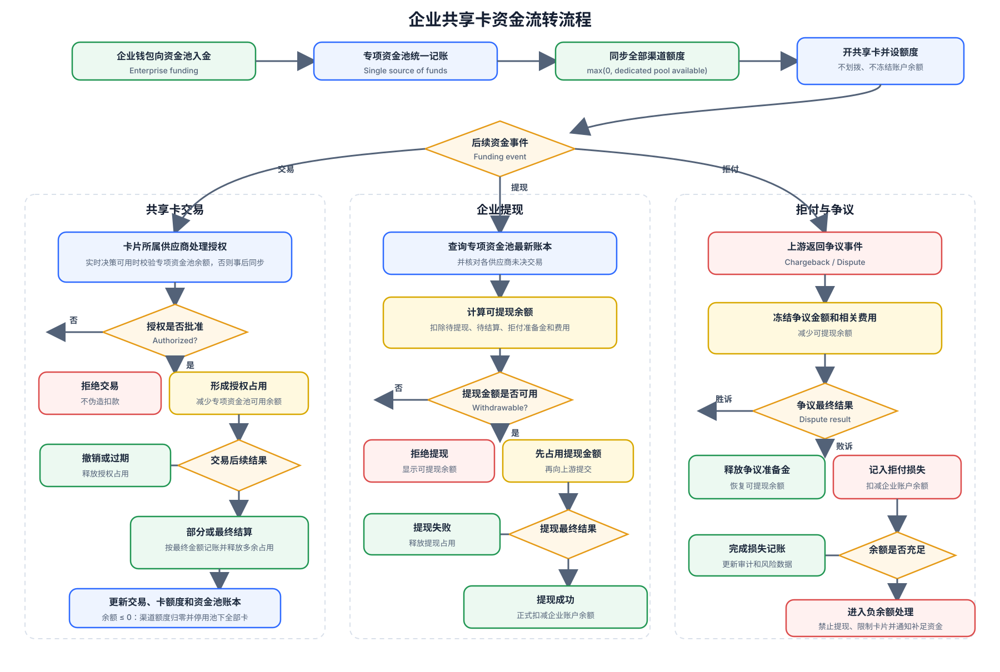
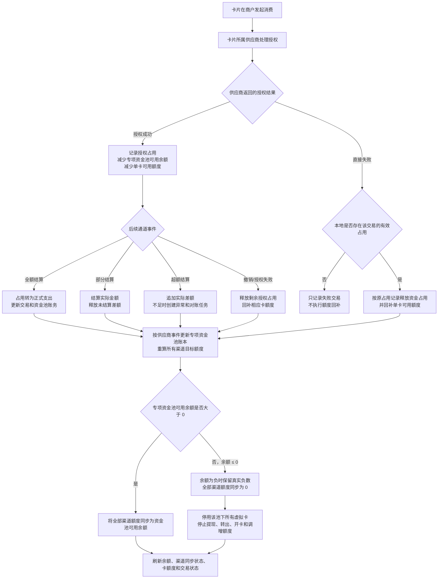
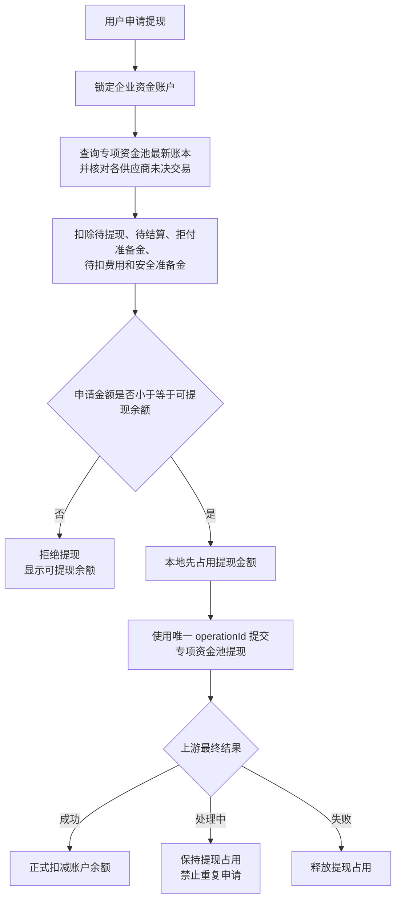
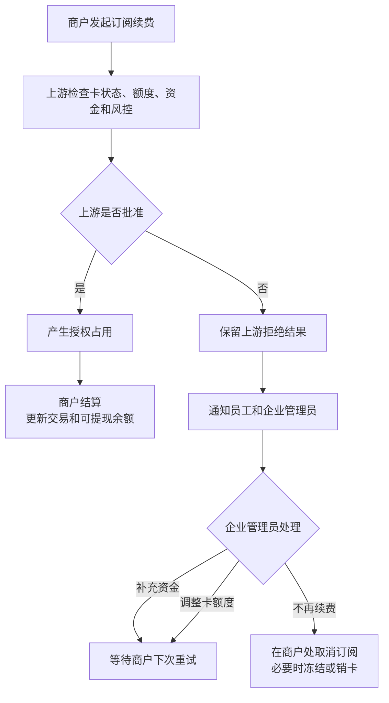

# 共享卡业务产品需求文档

## 1. 文档信息

| 项目 | 内容 |
| --- | --- |
| 产品名称 | UeePay 企业共享卡 |
| 文档类型 | 产品需求文档（PRD） |
| 文档状态 | 多通道方案评审稿 |
| 文档版本 | 2026-08-11 |
| MVP 币种 | USD |
| MVP 卡介质 | 虚拟卡 / Virtual Card |
| MVP 使用方式 | 企业管理员管理，员工通过团队账号使用本人卡片 |
| 产品架构 | UeePay 统一产品模型 + 多供应商适配层 |
| 单通道技术参考 | [共享卡业务实施方案](./共享卡业务实施方案.md)，仅作为现有 PhotonPay 方案参考，不代表本 PRD 的最终多通道实施方案 |
| 上游参考 | [PhotonPay OpenAPI](https://api-doc.photonpay.com/)、[Interlace Budget API](https://developer.interlace.money/v2.0/docs/budget-api)、[Interlace Card Transactions](https://developer.interlace.money/reference/listcardtransactions)、[WasabiCard OpenAPI](https://wsb.gitbook.io/wasabicard-doc)、[WasabiCard Card Issuance Process](https://wsb.gitbook.io/wasabicard-doc/guides/card-issuance-process) |

## 2. 产品背景

企业在广告投放、软件订阅、跨境采购、出差和项目支出中，通常需要为不同员工提供独立支付工具，并记录对应项目或用途。如果多人共用同一套卡号和 CVV，会导致交易责任难以追溯、私密信息暴露、离职或项目结束后无法局部停用等问题。

共享卡业务通过“一个企业/会员账户可拥有多个专项资金池 + 每个专项资金池直接关联多张不同渠道的独立虚拟卡 + 每卡独立额度”解决上述问题。每张卡只使用其绑定专项资金池的统一可用余额，同时受本卡单笔、每日、每月和累计可交易额度限制。

UeePay 对用户提供统一的共享卡产品，不要求企业理解 PhotonPay、Interlace 或 WasabiCard 的接口差异。专项资金池不绑定供应商，真实资金只在 UeePay 统一账本中记账；当该资金池首次使用某个供应商开卡时，服务端在该供应商创建或关联渠道额度账户，并将其额度同步为专项资金池当前可用余额。每张卡仍固定归属实际发卡供应商，不能静默迁移。

## 3. 产品目标

### 3.1 业务目标

- 共享卡业务仅面向已通过服务端资格校验的企业账户开放；个人账户可以看到并点击共享卡节点，但只能进入企业专属引导，不能开卡或访问共享卡业务数据。
- 让企业管理员可以快速为每名员工创建独立虚拟卡，并记录项目或用途。
- 让员工通过现有团队账号安全查看和使用本人卡片，不由管理员线下传递完整卡信息。
- 在共享企业资金的同时，将风险限制在单张卡片范围内。
- 使每笔交易都能追溯到卡片、用卡人、项目或用途和管理操作。
- 减少完整 PAN 和 CVV 在多人之间流转和长期保存的安全风险。
- 使用统一产品契约接入多个上游供应商，避免供应商字段、状态和资金术语直接泄漏到用户页面。
- 允许企业按部门、项目或用途建立多个相互隔离的 USD 资金池，并分别绑定共享卡。

### 3.2 用户目标

- 管理员可在一个入口完成共享卡的开卡、调额、冻结、解冻、销卡和交易查询。
- 管理员可清晰区分“企业钱包余额”“资金池余额”与“单卡可交易额度”。
- 系统在上游超时、异步处理或 Webhook 延迟时，不误导用户重复操作。
- 用户在正常用卡流程中不需要选择或理解底层供应商。

### 3.3 非目标

- MVP 向个人账户展示共享卡节点和企业专属引导，但不开放共享卡开卡、查询或管理能力。
- MVP 不提供员工自助开卡、调额、解冻、销卡、换绑或提现。
- MVP 不建设申请与多级审批流程。
- MVP 不提供实体卡、物流、激活、PIN、挂失和补卡。
- MVP 不支持 EUR、GBP 和跨币种换汇。
- MVP 不将卡片额度定义为已预留或已冻结资金。
- MVP 不允许企业手动选择底层供应商，也不承诺在供应商之间实时切换。
- MVP 不迁移已开卡片、已授权交易或历史账务到其他供应商。

## 4. 术语定义

| 术语 | English | 定义 |
| --- | --- | --- |
| 共享卡 | Shared Card | 从绑定资金池支付、但拥有独立卡号、用卡人和额度的虚拟卡 |
| 企业钱包 | Enterprise Wallet | 企业在 UeePay 的主资金来源，可向不同用途的专项资金池转入真实资金 |
| 专项资金池 | Dedicated Funding Pool | 企业/会员账户下按用途隔离的真实资金单元；一个企业可创建多个，每张虚拟卡直接绑定其中一个资金池并记录所属渠道，账本余额允许因跨渠道并发交易成为负数 |
| 供应商 | Provider | PhotonPay、Interlace、WasabiCard 等提供账户、发卡、交易或账务能力的上游服务方 |
| 渠道额度账户 | Provider Limit Account | 专项资金池在某一供应商侧创建或关联的内部额度控制单元；不是资金池，不代表新增一份真实资金，也不得与其他渠道额度账户相加计算企业资产 |
| 渠道额度 | Provider Limit | 同步给渠道额度账户的可消费上限，目标值为 `max(0, 专项资金池可用余额)`，因此供应商侧不出现负额度 |
| 资金池交易阻断 | Pool Transaction Block | 独立于卡片自身状态的资金池级交易控制；专项资金池余额 `<= 0`、渠道额度未完成保守同步或资金池被风控停用时生效 |
| 累计额度 | Total Spending Limit | 一张卡在当前生命周期内可交易的总上限，不代表资金预留 |
| 单笔限额 | Per-transaction Limit | 单笔交易允许的最高金额 |
| 日限额 | Daily Limit | 一个自然日内允许的累计交易上限 |
| 月限额 | Monthly Limit | 一个自然月内允许的累计交易上限 |
| 用卡人 | Cardholder | 与卡片唯一关联、通过本企业团队账号查看和使用本人卡片的员工 |
| 团队账号 | Team Account | 企业已创建并管理的员工账号，是员工访问本人共享卡的身份边界 |
| 业务操作号 | Operation ID | 由 UeePay 服务端生成的唯一业务操作标识，适配层映射为上游的 `requestId`、`Idempotency-Key`、`referenceId`、`clientTransactionId` 或 `merchantOrderNo` |

### 4.1 统一产品结构

```text
企业 Enterprise
├── 企业钱包 Enterprise Wallet
├── 专项资金池 A Dedicated Funding Pool
│   ├── 虚拟卡 A1 · PhotonPay 渠道
│   ├── 虚拟卡 A2 · Interlace 渠道
│   └── 虚拟卡 A3 · WasabiCard 渠道
└── 专项资金池 B Dedicated Funding Pool
    ├── 虚拟卡 B1 · PhotonPay 渠道
    ├── 虚拟卡 B2 · PhotonPay 渠道
    └── 虚拟卡 B3 · Interlace 渠道
```

统一结构必须满足：

- 一个企业/会员账户可以创建多个专项资金池。
- 一个专项资金池只使用一个结算币种，并可直接关联多个供应商渠道的虚拟卡。
- 一张共享卡只能绑定一个资金池和一个用卡人。
- 卡片创建成功后不允许更换专项资金池；换池必须销卡后在目标资金池重新开卡。
- 一张共享卡固定归属实际发卡供应商；卡片归属供应商与资金池不绑定供应商是两个不同概念。
- 一个资金池可以关联多张共享卡，多张卡共同消耗该资金池真实可用余额。
- 资金池余额属于企业；单卡额度只是消费控制，不构成卡片或员工对资金的所有权。
- 渠道额度账户仅为服务端内部同步实现，不作为产品层级展示；它只复制可消费上限，不复制资金，所有渠道额度不得汇总为企业资产。
- 企业管理员和员工页面不展示 PhotonPay、Interlace、WasabiCard 品牌；卡片渠道只保存在服务端及内部运营、审计和排障视图中。
- 卡片和交易创建后保留原供应商归属，不因路由策略变化自动迁移。

### 4.2 三家供应商映射

| UeePay 统一对象 | PhotonPay | Interlace | WasabiCard |
| --- | --- | --- | --- |
| 企业主体 | Member | Account | Merchant / Wallet owner |
| 默认资金来源 | Member 对应币种账户 | Infinity Account | WALLET Account |
| 渠道额度账户 | Matrix 对应币种额度范围，或 Member 交易额度范围 | Budget | Shared Account |
| 共享卡类型 | `cardType=share` | Budget Card | `BUDGET_CARD` / Share Card |
| 卡额度 | `transactionLimit` 及单笔、日、月限额 | Budget Card spending limit | Deposit/withdraw 接口在共享卡模式下表示额度增加/减少 |
| 渠道额度参考 | Member/Matrix 对应币种可消费额度 | Budget balance/limit | Shared Account `availableBalance`/额度 |
| 预付卡类型 | `cardType=recharge` | Prepaid Card | `PREPAID_CARD` |

供应商接口名称只用于服务端适配和内部运营排障。企业管理员与员工页面统一使用“资金池”“共享卡”“可交易额度”“转入资金”和“转出资金”。上表中的 Matrix、Budget 和 Shared Account 在本产品内按渠道额度账户使用，不代表企业同时拥有多份同额真实资金。

### 4.3 统一能力原则

- 统一核心能力包括：资金池查询、共享卡开卡、用卡人、调额、冻结、解冻、销卡、交易查询、Webhook 同步和对账。
- 供应商特有能力必须通过能力标识启用；页面不得因为接口不存在而展示不可执行按钮。
- 同一业务动作采用统一 UeePay 状态和错误语义，上游原始枚举、错误码和请求标识不直接面向用户。
- 上游暂不支持的能力必须明确降级为只读、人工处理或不开放，不使用前端模拟成功。
- 供应商路由由服务端决定；用户无权通过请求参数指定任意供应商账户、Matrix、Budget 或 Shared Account。

## 5. 用户和权限

### 5.1 用户角色

MVP 定义两个业务角色：已开通共享卡产品的企业管理员，以及被企业分配共享卡的团队员工。个人账户不是共享卡业务角色，但可以看到共享卡入口；点击后只显示“共享卡仅面向企业账户开放”的正式说明和企业认证/升级入口，不能进入概览、卡列表、资金池或通过直接请求接口开卡。

企业管理员负责开卡、额度、卡状态、资金和风险管理。员工通过现有团队账号使用本人卡片，但不因此获得企业余额、提现、其他员工卡片或企业级交易数据的访问权限。卡片申请主体、资金归属和最终风险责任始终属于企业。

### 5.2 权限矩阵

| 功能 | 企业管理员 | 员工团队账号 | 其他或未授权用户 | 服务端最终校验 |
| --- | --- | --- | --- | --- |
| 查看共享卡概览 | 允许 | 禁止 | 禁止 | 企业和权限 |
| 查看资金池列表和余额 | 允许 | 禁止 | 禁止 | 企业、资金权限和数据归属 |
| 创建专项资金池 | 按产品能力允许 | 禁止 | 禁止 | 企业、币种、资金权限和风控 |
| 资金池转入或转出 | 需资金权限和 2FA | 禁止 | 禁止 | 企业资金权限、余额、风控和幂等 |
| 查看企业全部共享卡 | 允许 | 禁止 | 禁止 | 数据归属和权限 |
| 查看本人共享卡 | 允许 | 允许 | 禁止 | 企业、团队成员和卡片归属 |
| 创建共享卡 | 允许 | 禁止 | 禁止 | 企业认证、权限、账户和风控 |
| 调整额度 | 允许 | 禁止 | 禁止 | 权限、卡状态和风控 |
| 冻结卡片 | 允许 | 仅本人卡 | 禁止 | 权限、卡归属和卡状态 |
| 解冻卡片 | 允许 | 禁止 | 禁止 | 权限、卡状态和风控 |
| 销卡 | 允许 | 禁止 | 禁止 | 权限、卡状态和二次确认 |
| 查看交易 | 企业全部 | 仅本人卡 | 禁止 | 数据归属和权限 |
| 查看完整卡号和 CVV | 需额外授权和 2FA | 仅本人卡且需 2FA | 禁止 | 权限、2FA、卡归属、卡状态和风控 |
| 报告异常交易 | 允许 | 仅本人卡 | 禁止 | 卡归属、交易归属和受理时限 |
| 查看企业余额或提现 | 允许 | 禁止 | 禁止 | 企业资金权限 |

## 6. 范围与信息架构

### 6.1 入口

共享卡放入现有“卡片管理”，作为独立页签：

```text
常规卡 | 共享卡 | 开卡记录 | 卡片账单
```

共享卡与常规卡使用独立的查询参数、列表动作和详情业务规则，避免互相影响。

“共享卡”节点对个人账户和企业账户均可见。个人账户点击后进入企业专属引导页；企业账户点击后再由服务端判断企业认证、产品开通、地区、权限和风控条件，进入共享卡业务页或显示对应不可用原因。

### 6.2 页面清单

| 页面或弹窗 | 目标 |
| --- | --- |
| 共享卡概览 | 展示企业钱包、资金池与卡片核心指标 |
| 资金池列表 | 展示资金池名称、币种、余额、状态、卡片数量和用途 |
| 资金池详情 | 展示池内卡片、资金流水、余额口径和操作审计 |
| 创建资金池 | 创建命名专项资金池；不允许用户选择底层供应商，后续开卡时由服务端按渠道能力创建渠道额度账户 |
| 资金池转入/转出 | 在专项资金池与企业钱包之间显式划转资金 |
| 共享卡列表 | 查询、筛选和管理共享卡 |
| 创建共享卡 | 选择资金池、卡产品、用卡人并配置额度 |
| 共享卡详情 | 展示卡信息、额度、用卡人、交易和审计 |
| 调整额度弹窗 | 调整累计、单笔、日和月限额 |
| 员工“我的共享卡” | 团队员工查看本人卡片、额度、交易、通知和安全操作 |
| 异常交易报告 | 员工报告本人卡片的异常交易并进入人工处理 |
| 冻结/解冻确认弹窗 | 明确操作影响并防止误操作 |
| 销卡确认弹窗 | 告知不可逆后果并完成二次确认 |
| 卡片私密信息弹窗 | 授权后临时展示 PAN、有效期和 CVV |

## 7. 核心用户旅程

### 7.1 创建共享卡



### 7.2 员工使用共享卡



1. 员工使用现有团队账号登录 UeePay。
2. 服务端确认团队账号有效、属于当前企业且已绑定共享卡。
3. 员工进入“我的共享卡”，只看到本人卡片、额度、交易和通知。
4. 默认只显示脱敏卡号；员工主动查看私密信息时完成 2FA。
5. 2FA 成功后临时显示 PAN、有效期和 CVV，关闭页面后立即清理。
6. 员工在商户侧使用卡片；发生 3DS 时，验证码发送到团队账号已验证的手机号或邮箱。
7. 交易结果同步后，员工看到本人交易通知；管理员看到企业侧交易和风险结果。
8. 员工发现异常交易时可以立即冻结本人卡并提交异常报告，后续由管理员和运营处理。

### 7.3 调整额度

1. 管理员进入共享卡详情或列表操作区。
2. 打开“调整额度”弹窗。
3. 页面展示当前额度、已用额度和资金池余额。
4. 管理员输入新额度并确认。
5. 系统展示调整前后差异。
6. 提交后按钮进入 loading，禁止重复提交。
7. 结果未知时保留“调整中”，等待服务端确认。
8. 确认成功后更新卡片额度和审计记录。

### 7.4 冻结和解冻

1. 管理员选择冻结，系统告知冻结将影响新交易。
2. 确认后卡状态变为“冻结中 / Freezing”。
3. Webhook 或补查确认后变为“已冻结 / Frozen”。
4. 管理员冻结的卡可按权限解冻。
5. 风控冻结或系统冻结不提供直接解冻操作。

员工可以冻结本人卡，但不能自行解冻。员工冻结后，由管理员核实原因并决定是否解冻或销卡。

### 7.5 销卡

1. 管理员打开销卡确认弹窗。
2. 页面明确提示销卡不可恢复，已存在交易记录仍会保留。
3. 用户主动确认后提交。
4. 卡状态变为“销卡中 / Cancelling”，禁止其他状态操作。
5. 确认成功后变为“已销卡 / Cancelled”。

### 7.6 共享卡完整业务流程



说明：“创建共享卡或设置卡额度时不冻结资金池余额”与“实际交易授权可能占用资金”是两个不同概念。后者由实际供应商、发卡行和卡组织的交易与账务规则决定。

### 7.7 共享资金流转流程



资金流转原则：

- 共享卡的开卡主体、资金池、可提现余额和拒付责任均归属企业。
- 用卡人只使用企业分配的卡片，不拥有企业资金提现权。
- 开卡和设置额度不冻结资金；真实交易授权、待提现和争议会影响可提现余额。
- 每个专项资金池从企业钱包转入真实资金；渠道额度账户不单独入金，也不代表新增资金。
- 每笔卡交易的授权、撤销、结算和争议结果以该卡所属供应商的事件为准；跨供应商的统一余额以 UeePay 专项资金池账本为准。

### 7.8 多通道交易同步与额度回补



同步原则：

- 每张卡固定归属一个供应商并绑定一个专项资金池；一笔交易先影响该专项资金池，再将新的目标额度同步到该资金池下所有渠道额度账户。
- 该卡所属供应商是本笔交易结果的最终来源；UeePay 专项资金池账本是跨供应商统一余额的最终控制账本。渠道额度账户只承载额度，不拥有独立资金。
- 同一个供应商事件必须在一个数据库事务中更新交易、授权占用、专项资金池账本、单卡额度和账务流水；提交后异步但立即触发全部渠道额度同步。
- 消费失败不等于无条件增加余额。只有本地已记录有效授权占用时，才能按未结算剩余金额释放占用和回补额度。
- 重复 Webhook、重复补查和乱序事件不得重复扣减或重复回补；所有变动必须引用原交易或原授权占用。
- 释放金额不得超过原授权尚未释放的剩余金额；失败事件从未形成有效占用时只记录失败，不回补资金。
- 专项资金池允许因跨供应商并发消费、延迟事件或超额结算成为负数；渠道额度不得为负，统一按 `max(0, 专项资金池可用余额)` 同步。
- 专项资金池可用余额 `<= 0` 时，该资金池下所有渠道的全部虚拟卡禁止新交易；不影响企业其他余额 `> 0` 的专项资金池及其虚拟卡。
- 若供应商支持实时授权决策，UeePay 应在批准前原子占用专项资金池资金；不支持时采用事后事件同步，并以负余额承接并发敞口，不对外承诺全通道强一致。
- 任一渠道额度降低失败时，该供应商进入降级状态并冻结相关卡片，持续重试和告警，避免其继续使用旧额度消费。

## 8. 详细功能需求

### 8.1 FR-SC-001：功能可用性

- 共享卡节点对个人账户和企业账户均显示，但节点可见不代表拥有共享卡业务权限。
- 个人账户点击共享卡节点后，只显示企业专属引导、适用主体说明和现有企业认证/升级入口，不请求共享卡概览、资金池、卡列表或交易数据。
- 只有服务端同时确认“当前账户为企业账户”和“共享卡产品已开通”时，才允许进入共享卡业务页。
- 企业认证状态必须满足服务端开卡要求，前端不自行降低认证条件。
- 前端隐藏页签不代表服务端授权，直接请求接口仍需服务端校验。
- 个人账户访问共享卡入口路由时允许展示不含业务数据的企业专属引导；直接访问概览、资金池、卡列表、交易或开卡接口时统一返回无权结果，不暴露企业产品配置。
- 企业认证、账户或地区不符合要求时，显示明确且不承诺审核结果的引导。

### 8.2 FR-SC-002：共享卡概览

概览区显示：

- 企业钱包可用余额。
- 各 USD 资金池的名称、账面余额、可用余额、冻结/授权占用和同步状态。
- 共享卡总数。
- 正常卡数。
- 冻结卡数。
- 本月共享卡消费。

规则：

- 金额显示币种符号和两位小数。
- 专项资金池为负数时直接显示负数和“待补资金”状态，不截断为 `0.00`。
- 资金池余额未加载或加载失败时不显示为 `0.00`。
- 聚合余额必须由各专项资金池最后已确认的真实账本余额计算；不得汇总渠道额度。
- 资金池显示“最后同步时间”；超过服务端配置的新鲜度阈值时标记“数据更新中”，不允许用过期余额放行资金操作。
- 刷新概览不中断已提交的非幂等操作。

### 8.3 FR-SC-003：共享卡列表

列表字段：

- 脱敏卡号。
- 卡昵称。
- 用卡人。
- 项目或用途。
- 卡状态。
- 累计额度、已用额度和剩余额度。
- 单笔、日和月限额。
- 本月消费。
- 创建时间。

筛选条件：

- 卡状态。
- 卡昵称，支持模糊查询。
- 脱敏卡号或后四位。
- 用卡人。
- 项目或用途。
- 创建时间范围。

列表规则：

- 默认按创建时间倒序。
- 查询、筛选和分页可以使用同组只保留最新请求策略。
- 列表不获取、不保存和不显示完整 PAN、有效期和 CVV。
- 移动端优先显示脱敏卡号、卡昵称、状态、剩余额度和主操作。

### 8.4 FR-SC-004：创建共享卡

开卡主体规则：

- 服务端必须在每次提交时确认当前登录主体是企业账户。
- 卡片、用卡人、项目、资金池和后续交易必须绑定到同一企业数据归属边界。
- 前端不传入可用于任意指定归属的用户 ID 或企业 ID；归属由服务端根据登录态决定。

用卡人准入流程：

1. 管理员只能选择本企业状态正常的团队员工。
2. 服务端完成目标发卡供应商路由后，查询团队账号与该供应商 Cardholder 的映射和最新审核状态。
3. 尚未创建上游用卡人的员工进入“待完善资料”，系统向员工团队账号发送持卡人资料和协议确认任务。
4. 员工通过本人团队账号补充上游要求的姓名、联系方式、地址和其他必要资料，并确认适用的持卡人协议。
5. 服务端通过供应商适配层提交用卡人资料；审核中、待完善、拒绝或禁用状态均不能开卡。
6. 只有对应供应商明确返回“可用 / Active”后，管理员才能为该员工提交开卡。
7. 用卡人资料、协议版本、确认时间和上游结果进入审计，但敏感资料不得写入普通操作日志。

表单字段：

| 字段 | 必填 | 产品规则 |
| --- | --- | --- |
| 资金池 | 是 | 仅显示当前企业状态正常、余额可查询且允许开卡的 USD 资金池 |
| 卡产品 | 是 | 只显示服务端为所选专项资金池路由后可用、支持共享模式的 USD 虚拟卡产品；不显示供应商名称和原始 BIN 参数 |
| 用卡人 | 是 | 仅可选择服务端允许用于开卡的用卡人 |
| 项目或用途 | 是 | 用于内部识别和审计，不作为上游风控结果 |
| 卡昵称 | 是 | 最长 50 个字符，需通过服务端校验 |
| 累计额度 | 是 | 必须大于 0，不表示资金预留 |
| 单笔限额 | 是 | 必须大于 0 且不高于累计额度 |
| 日限额 | 是 | 必须大于 0 且不高于累计额度 |
| 月限额 | 是 | 必须大于 0，不高于累计额度，且不低于日限额 |

提交规则：

- 系统不允许使用 `unlimited`，MVP 共享卡统一使用 `limited`。
- 服务端根据企业准入、卡产品、供应商能力和运营配置选择发卡供应商；前端不得传入供应商名称或任意上游账户 ID。
- 该专项资金池首次使用目标供应商开卡时，服务端必须先创建或关联渠道额度账户，并将渠道额度同步为当前资金池可用余额；创建或同步失败时不得开卡。
- 前端使用定点小数工具进行展示和提交前比较，服务端重新校验。
- 提交按钮点击后立即进入 loading 并禁用。
- 客户端不对开卡 POST 自动重试。
- 结果未知时进入“处理中 / Pending”，不显示“开卡失败”或“开卡成功”。

### 8.5 FR-SC-005：共享卡详情

卡片详情分为：

- 卡片概览：脱敏卡号、卡昵称、BIN、卡组织、币种、卡状态和创建时间。
- 额度信息：累计额度、已用额度、剩余额度、单笔限额、日限额和月限额。
- 用卡人信息：只展示业务必要的脱敏信息。
- 交易记录：参见 FR-SC-011。
- 操作审计：参见 FR-SC-012。

当卡状态为处理中时，页面必须标识当前处理动作，不允许冲突操作。

### 8.6 FR-SC-006：查看卡片私密信息

- 默认只显示脱敏卡号。
- “查看卡片信息”必须是用户主动操作。
- 企业管理员只能按服务端授权策略查看卡片私密信息；员工只能查看本人卡片私密信息。
- 服务端可以要求统一 2FA，前端不得绕过。
- 授权成功后才临时返回完整 PAN、有效期和 CVV。
- 私密信息弹窗关闭、失去可见性、请求失败或组件卸载时必须清理临时数据。
- 复制必须由用户主动触发，不自动复制，不记录复制内容。
- 完整 PAN 和 CVV 不进入 Store、URL、日志、埋点、错误上报或持久化存储。

### 8.7 FR-SC-007：调整额度

- 弹窗展示当前值、新值和差额。
- 新累计额度不得低于已用额度；服务端有更严格限制时以服务端为准。
- 单笔、日和月限额必须满足创建卡的大小关系。
- 每次调额是独立的非幂等操作，必须防止重复提交。
- 销卡中、已销卡、过期或存在冲突处理中操作时，不允许调额。
- 调额前后值和操作结果进入审计。

### 8.8 FR-SC-008：冻结和解冻

- 正常卡可以发起冻结。
- 管理员冻结成功的卡可以发起解冻。
- 风控冻结和系统冻结不显示可用的解冻操作。
- 冻结或解冻处理中时，不允许重复提交或发起销卡。
- 操作成功由服务端确认，不以前端按钮点击为成功依据。

### 8.9 FR-SC-009：销卡

- 销卡是不可逆危险操作，必须二次确认。
- 确认弹窗显示脱敏卡号、卡昵称和不可恢复说明。
- 已销卡不允许解冻、调增额度或查看 CVV。
- 已销卡的历史交易和审计记录继续保留。

### 8.10 FR-SC-010：员工团队账号用卡

- 团队员工只在服务端确认其团队账号有效、属于当前企业且是卡片唯一用卡人时看到“我的共享卡”。
- 员工只能查看本人卡片的脱敏信息、额度、本人交易和本人通知。
- 员工查看 PAN、有效期和 CVV 前必须完成 2FA，私密信息只在当前会话短暂存在。
- 员工可以冻结本人正常卡，但不能自行解冻、调额、销卡、创建卡、变更用卡人或查看企业资金池余额。
- 员工可以对本人交易提交异常报告；提交报告不等于争议已受理或一定退款。
- 3DS 验证发送到团队账号绑定且已验证的手机号或邮箱，具体方式以卡片所属供应商和发卡行能力为准。
- 团队账号被禁用、移出企业或员工离职时，服务端必须立即撤销卡片查看和 3DS 权限，并自动冻结该员工的全部共享卡。
- 一张卡创建后永久绑定原员工，不支持更换用卡人；其他员工需要用卡时由管理员另行开新卡。
- 原员工卡销卡后，历史交易、退款、争议和审计仍按原卡及原员工保留。

### 8.11 FR-SC-011：交易记录

交易列表建议显示：

- 交易时间。
- 交易 ID。
- 脱敏卡号和卡昵称。
- 商户名称。
- 交易类型。
- 交易状态。
- 授权金额和币种。
- 结算金额和币种（已有结算结果时）。
- 交易发起类型。

规则：

- 交易状态和类型必须使用系统 Locale 映射，不在页面硬编码翻译。
- 授权和结算是不同事件，不得在结算前将授权金额表达为最终支出。
- Webhook 延迟时允许显示处理中，不伪造成功或失败。
- 交易查询不显示完整卡号和 CVV。

### 8.12 FR-SC-012：操作审计

审计记录包含：

- 操作时间。
- 管理员脱敏身份标识或系统可读名称。
- 操作类型。
- 脱敏卡号和卡昵称。
- 调额前后值（调额操作）。
- 请求状态。
- 可安全展示的失败原因。

审计记录不显示完整 PAN、CVV、Token、证件资料、风控规则和上游原始报文。

### 8.13 FR-SC-013：资金池管理

- 一个企业可以拥有多个 USD 专项资金池，每个资金池必须有唯一名称、用途、状态和统一真实账本，不绑定任何供应商。
- 资金池数量上限、单资金池卡片上限、单渠道卡片上限和允许接入的渠道数量由服务端按企业等级和风控配置，前端不写死。
- 所有专项资金池均从企业钱包显式转入资金；渠道额度账户不得被当作独立入金账户。
- 用户只看到专项资金池名称、用途、币种、账面余额、可用余额和状态；渠道额度账户及其原始标识只对内部运营和审计可见。
- 创建资金池、转入和转出均由服务端校验专项资金池账本余额、企业权限、2FA、风控和幂等。
- 资金池存在处理中交易、授权占用、负余额、争议或供应商限制时，转出金额不得超过服务端计算的可转出余额。
- 资金池不得物理删除。停用后仍允许转入、退款、失败释放、撤销、费用入账、延迟结算、争议处理和对账；禁止转出、新开卡、调增额度和新的卡交易。
- 资金池只有在余额为 `0`、无有效授权占用、无未决交易、无退款处理中、无争议或准备金、无待扣费用且全部卡片已销卡时，才允许关闭；关闭后只读保留账务和审计记录。
- 资金池名称和用途可以按权限修改；币种、企业归属、卡片归属和历史账务关系创建后不可修改。

### 8.14 FR-SC-014：供应商路由和渠道额度账户

- 服务端根据企业准入、地区、币种、卡产品、供应商能力、可用 BIN、风控和运营配置选择供应商。
- 专项资金池不保存唯一供应商绑定；同一专项资金池可同时为 PhotonPay、Interlace 和 WasabiCard 建立独立渠道额度账户。
- 同一专项资金池在某供应商首次开卡前，必须创建或关联该供应商的渠道额度账户；同供应商后续卡片优先复用该账户。
- 卡片固定保存其实际发卡供应商和对应渠道额度账户；路由配置变化只影响后续新卡，不修改存量卡和交易归属。
- 每次专项资金池余额变化后，服务端计算 `渠道目标额度 = max(0, 专项资金池可用余额)`，并同步该资金池下所有启用的渠道额度账户。
- 渠道额度仅用于供应商侧消费控制，不代表充值或资金复制；多个渠道额度不得相加展示为企业余额。
- 任一渠道额度同步失败时记录 `failed`、告警并重试；无法及时下调额度时冻结该供应商相关卡片。其他渠道额度账户仍同步为最新保守值。
- 内部运营和审计可以查看供应商信息，企业管理员和员工的正常用卡页面不展示供应商品牌和原始错误码。

### 8.15 FR-SC-015：交易、资金池和额度一致性

- 服务端为每笔供应商交易建立唯一映射，并保存供应商交易 ID、原交易 ID、事件 ID、事件版本或更新时间。
- 授权成功时，必须同时记录交易、授权占用、专项资金池可用余额变化和单卡可用额度变化，并触发全部渠道额度同步。
- 授权直接失败且从未产生有效占用时，只记录失败结果，不增加资金池余额或卡额度。
- 已授权交易后续失败、撤销或部分撤销时，只释放尚未结算的原占用金额，不得超过原占用余额。
- 全额结算时将占用转为正式支出；部分结算时释放差额；超额结算时追加差额并触发余额不足或对账异常处理。
- 退款创建独立入账交易并关联原消费，不修改原消费终态；实际入账后增加原卡绑定专项资金池的余额。退款不恢复单卡累计、日或月已用额度，授权失败、撤销和未结算差额释放才回补相应卡额度。
- 重复、乱序或延迟事件必须幂等处理，任何扣减和回补都必须生成不可变账务流水。
- Webhook 处理后按供应商能力补查交易详情；定时对账至少覆盖交易、专项资金池账本、授权占用、卡额度和所有渠道额度五类差异。
- 本地与供应商数据不一致时，页面标记“同步中/待对账”，资金操作使用更保守的可用金额，禁止以前端缓存覆盖服务端账本和供应商交易终态。
- 跨供应商并发交易造成专项资金池负数时，负数必须真实入账，不截断为 0；所有渠道额度同步为 0，并停止新的消费、提现、开卡和调增额度。
- 专项资金池可用余额从正数变为 `<= 0` 时，服务端必须按以下顺序执行：先原子写入资金池交易阻断并拒绝所有可控的新授权，再提交全部渠道额度归零任务；不支持实时授权决策且无法立即归零的渠道必须冻结该池在该渠道下的全部虚拟卡。
- 渠道归零期间资金池保持 `balance_blocked`，任一渠道失败则保持阻断、告警并重试，不得因部分渠道成功而恢复交易。
- 余额恢复到 `> 0` 后，先同步全部启用渠道额度；只有所有渠道确认成功，才解除资金池交易阻断。解除阻断不得改变卡片原有的用户冻结、风控冻结、销卡、过期或其他不可交易状态。

## 9. 业务规则

### 9.1 资金池规则

- **MVP 产品决策：创建共享卡、设置卡额度或冻结卡片时，不冻结、不预留专项资金池余额。**
- 所有 MVP 共享卡使用其绑定 USD 专项资金池的统一真实资金，不跨专项资金池自动借用。
- 卡片累计额度是消费上限，不是从资金池中划拨、冻结或预留的资金。
- 创建卡片或提高卡额度后，资金池可用余额不因该配置动作减少。
- 冻结卡片只禁止该卡发起新交易，不冻结整个资金池余额，也不影响池内其他卡片。
- 实际交易授权可能按对应供应商和卡组织账务规则对资金进行占用或扣减，该行为与设置卡额度不同。
- 共享卡本身不展示可转入或可转出余额。
- 卡片页面不提供常规卡的“转入”和“转出”操作；专项资金池的资金划转只能从资金池页面发起。
- 专项资金池可用余额 `<= 0` 时必须显示真实结果并停用池下全部虚拟卡；因跨供应商并发或延迟事件发生超额时，余额按实际金额记为负数。
- 同一企业不同资金池之间不直接互相扣款；需要调拨时必须通过企业钱包或服务端支持的显式资金划转流程完成。
- 同一专项资金池下的渠道额度始终来自该资金池的可用余额；渠道额度不拥有独立资金，也不得相加。

示例一：项目 A 的专项资金池可用余额为 `$2,000`，已在供应商 1 和供应商 2 开卡，则两个渠道额度账户的额度均为 `$2,000`，但企业真实资金仍只有 `$2,000`。供应商 1 的卡消费并有效占用 `$1,000` 后，专项资金池可用余额变为 `$1,000`，两个渠道额度都同步为 `$1,000`。

示例二：同一专项资金池初始可用余额为 `$2,000`，供应商 1 和供应商 2 因并发分别成功占用 `$1,500` 和 `$1,000`，专项资金池余额按实际结果记为 `-$500`，两个渠道额度均同步为 `$0`。后续若供应商 1 的 `$1,500` 交易确认失败且原占用仍未释放，则准确释放 `$1,500`，专项资金池余额恢复为 `$1,000`，两个渠道额度恢复为 `$1,000`。

负余额风险边界：

- 系统必须为企业、专项资金池、供应商渠道和单卡分别配置最大负余额敞口、交易速率和单次授权上限，不允许无限负数。
- 新增渠道或提高渠道额度前，必须评估同一资金池所有渠道的最大并发授权敞口；超过企业或资金池风险上限时不得启用。
- 达到任一风险阈值时立即保持资金池交易阻断、将全部渠道目标额度设为 0、冻结无法实时阻断的渠道卡片，并生成高优先级风险事件。
- 最大负余额、渠道数量和熔断阈值由资金、风控和运营按企业等级配置，企业管理员和前端不能自行修改。

账务归属规则：

- 卡片销卡、过期或员工离职后发生的退款、延迟结算、超额结算、费用和争议，仍进入该卡创建时绑定的原专项资金池。
- 资金池停用后继续接收上述账务事件；不得将退款、费用或争议改记到企业钱包或其他专项资金池。
- 交易费、跨币种费、拒付费和供应商校正差额默认归属原交易所在专项资金池；无法关联原交易的企业级费用按服务端配置进入指定企业账务账户并保留审计依据。
- 资金池关闭前必须等待所有延迟账务风险窗口结束；关闭后收到例外账务事件时重新进入只读待处理状态并生成运营任务，不允许丢弃事件。

### 9.2 额度规则

一笔交易可用额度由以下条件中的最低允许值决定：

```text
专项资金池实际可用余额（实时决策可用时）
卡片累计剩余额度
卡片当日剩余额度
卡片当月剩余额度
卡片单笔限额
对应供应商和 UeePay 风控允许额度
```

单卡累计额度不冻结或预留企业资金。多张卡的累计额度之和可以高于当前资金池余额；支持实时授权决策的供应商在批准前校验专项资金池可用余额，不支持的供应商可能因并发产生负余额，UeePay 按负余额规则立即收敛风险。

### 9.3 用卡人规则

- 一张共享卡只关联一个团队员工，且创建后不允许更换用卡人。
- 用卡人必须处于服务端允许开卡的状态。
- 前端不能仅通过本地选项判断用卡人是否可用。
- 用卡人必须关联本企业有效团队账号，卡片归属由服务端维护，不能由前端任意传入企业或用户 ID。
- 团队账号、供应商用卡人资料和共享卡之间必须建立唯一且可审计的映射。
- 团队账号被禁用或移出企业时，立即撤销私密信息和 3DS 权限并冻结其共享卡。
- 员工离职或职责变更后，管理员应销卡；其他员工需要使用时重新创建独立卡片。
- 原员工与原卡的历史交易、授权、退款、争议和审计关系永久保留，不转移给其他员工。

### 9.4 幂等和防重复规则

- 创建资金池、转入、转出、停用、恢复、关闭、开卡、调额、冻结、解冻和销卡均按非幂等业务操作管理。
- 每次操作使用服务端生成的唯一 `operationId`，适配层再生成或映射供应商要求的幂等标识。
- 前端超时不代表上游失败，不自动重新发起。
- 重复点击、刷新页面或重新登录不得创建新的同业务请求。
- 资金划转结果未知时保持原资金占用并使用原 `operationId` 补查；不得生成新操作号再次划转。

### 9.5 上游发卡行与 UeePay 责任边界

每张卡所属供应商及其发卡行是该卡交易结果的上游来源；UeePay 专项资金池账本是跨供应商统一余额来源。UeePay 不能把供应商拒绝结果改写为成功。

| 能力 | 责任方 | UeePay 产品边界 |
| --- | --- | --- |
| 卡交易授权批准或拒绝 | 对应供应商/发卡行 | 展示上游确认结果，不伪造成功 |
| 卡网络授权、清算和结算 | 对应供应商/卡组织 | 接收并对账授权、撤销、结算和调整事件 |
| 拒付或交易争议裁决 | 对应供应商/卡组织 | 配合提交资料、冻结争议资金并反映最终结果 |
| 企业可以提取的金额 | UeePay + 对应供应商账户能力 | 只允许提取经计算的可提现余额 |
| 本地待提现资金占用 | UeePay | 提现提交前先在本地账本占用，防止重复提现 |
| 拒付准备金和负余额限制 | UeePay + 合同约定 | 决定用户可提现额度、限制操作和追偿流程 |

用户可见表达不得承诺“保证交易成功”“保证订阅不中断”或“完全防止拒付”。

### 9.6 余额口径和可提现余额

产品不能将“账面余额”直接当作“可提现余额”。

| 余额类型 | English | 定义 |
| --- | --- | --- |
| 账面余额 | Ledger Balance | 根据已确认账务记录计算的账户余额 |
| 专项资金池余额 | Dedicated Pool Balance | UeePay 统一账本根据入金、支出、释放、退款、费用和争议计算的真实余额，允许为负数 |
| 渠道额度 | Provider Limit | 同步到各供应商侧的消费控制额度，最低为 0，不代表真实资金余额 |
| 授权占用 | Authorization Hold | 已批准但未完成结算或撤销的卡交易资金占用 |
| 待结算负债 | Unsettled Liability | 已知但尚未完成最终记账的交易义务 |
| 待提现占用 | Pending Withdrawal Hold | 已提交但未确认最终结果的提现资金 |
| 拒付准备金 | Dispute Reserve | 用于覆盖潜在拒付本金、费用和其他争议负债的不可提现金额 |
| 可提现余额 | Withdrawable Balance | 完成所有占用、负债、费用和准备金扣减后允许提现的最大金额 |

建议计算公式：

```text
专项资金池可用余额 =
  专项资金池账面余额
  - 未计入账面的有效授权占用
  - 待结算负债
  - 待扣费用
  - 拒付准备金

渠道目标额度 = max(0, 专项资金池可用余额)

可提现余额 = max(
  0,
  专项资金池可用余额
  - UeePay 待提现占用
  - 最低安全准备金
)
```

规则：

- UeePay 必须以专项资金池统一账本计算可提现余额，并使用各供应商交易与授权事件核对负债，不能将任一渠道额度当作真实余额放行提现。
- 同一授权占用在专项资金池账本中只能扣减一次；供应商事件重放、补查和渠道额度同步不得重复记账。
- 多个渠道额度不得汇总为企业总余额；企业总览只汇总不同专项资金池的真实账本余额。
- 对余额字段的最终口径必须在 UAT 用授权、撤销、部分结算、超额结算和提现并发场景验证。

### 9.7 提现风险控制



提现规则：

- 提现校验和本地占用必须在服务端原子处理，前端按钮禁用不能代替资金锁。
- 提现是非幂等操作，客户端不得因超时自动重试。
- 提现结果未知时必须保持待提现占用，直至服务端确认最终结果。
- 如系统无法在授权、渠道额度同步和提现之间实现可靠占用，则不允许对该资金池开放全额实时提现。

### 9.8 订阅续费处理

订阅续费由订阅商户在每个周期重新发起交易授权。UeePay 不能主动代替商户重新扣款，也不能要求上游必须批准。



MVP 订阅规则：

- 资金池余额或卡额度不足时，上游可以拒绝续费。
- UeePay 不自动充值、不主动调高卡额度且不主动重试商户扣款；跨供应商并发产生的负余额按已确认交易真实入账，但负余额状态下禁止新的消费。
- 如上游返回明确的可展示原因，页面区分“企业账户可用余额不足”和“卡片可交易额度不足”。
- 如上游未返回可安全展示的拒绝原因，统一显示“交易未通过 / Transaction declined”，不由前端猜测。
- 商户可能多次重试失败订阅；UeePay 只记录和展示真实交易事件，不合并为一笔伪造结果。
- 冻结或销卡不等于在商户处取消订阅，用户仍应在商户处完成取消。
- 员工团队账号禁用或离职导致卡片冻结、销卡时，系统必须提醒管理员检查该卡关联的订阅和商户绑卡。
- 旧卡不允许转交给其他员工；需要继续订阅时，管理员为新员工开新卡并在商户侧更新支付方式。

MVP 不承诺订阅不中断。如后续要提供“订阅保障”，必须另行定义订阅金额、周期、资金预留、释放、取消和变更规则，不属于当前 MVP。

### 9.9 拒付准备金和负余额

本节的“拒付”指交易结算后的 Chargeback/Dispute，不是上游在授权阶段返回的交易拒绝。

准备金规则：

- 拒付准备金从可提现余额中扣除，但不对用户表达为卡片额度。
- 准备金可以由固定最低金额、近期已结算交易比例、已发生争议金额和风险等级组成。
- 新企业、异常交易增长、高风险商户类别或历史拒付率升高时，可以提高准备金。
- 已发生争议的金额在争议结束前不释放。
- 准备金比例、最低金额、持有期限和调整权限必须由资金、财务、风控、法务和对应供应商联合确认，不由前端写死。

争议处理流程：

1. 对应供应商返回争议事件后，系统创建唯一争议记录并冻结争议本金、费用和必要准备金。
2. 管理员可以查看争议原因、金额、关联员工、证据要求和提交截止时间。
3. 员工只能查看本人相关争议并补充业务说明或凭证，不能代表企业正式提交或接受责任。
4. 企业管理员确认材料后，由服务端或运营按对应供应商约定渠道提交证据。
5. 提交中、待裁决、胜诉、败诉和已关闭状态必须来自上游确认，不由前端推断。
6. 胜诉后释放对应准备金；败诉后记入拒付本金和费用，余额不足时进入负余额处理。
7. 超过证据截止时间仍未提交时，显示“已超期”，不得承诺仍可申诉。

负余额处理：

1. 专项资金池保留真实负数，不显示为 0，也不将超额部分隐藏到供应商差异中。
2. 将该专项资金池下所有渠道目标额度同步为 0；同步失败的供应商立即冻结相关卡片并告警。
3. 立即禁止该资金池新的消费、提现、转出、新建共享卡和调增卡额度。
4. 通知企业管理员补足资金，并生成风险事件和人工处理任务。
5. 后续入金、交易失败释放、撤销和退款先按账务顺序冲抵负余额；释放不得超过原交易尚未释放的占用。
6. 专项资金池可用余额恢复到 `> 0` 后，将所有启用渠道额度恢复为该正数金额，并在同步完成后按风控策略恢复该池下虚拟卡的新交易。
7. 达到合同或风控阈值后，进入账户限制或追偿流程。

### 9.10 上游能力不足时的降级策略

供应商能力分为“支持实时授权决策”和“仅提供授权后事件”两类。支持实时决策时，UeePay 在供应商要求的响应时限内原子校验并占用专项资金池；仅提供授权后事件时，无法保证跨供应商消费强一致，系统允许真实余额因并发成为负数，并采用以下降级组合：

- 不开放全额实时提现。
- 提现进入延迟审核，等待对应交易清算窗口。
- 保留固定和动态准备金。
- 对大额提现、新企业和异常交易增长进行人工审核。
- 存在未确认卡交易时，限制企业提取全部资金。
- 渠道额度同步失败时冻结对应供应商卡片，并对其他渠道额度账户同步最新保守额度。
- 明确告知用户可提现余额与账面余额可能不同。
- 不对订阅成功、拒付结果或交易时效作出确定承诺。

卡交易存在授权、清算和结算阶段，授权与最终结算金额可能不同。实施时应参考 [Mastercard Transaction Processing Rules](https://www.mastercard.com/content/dam/mccom/shared/business/support/rules-pdfs/transaction-processing-rules.pdf) 和上游实际合同与接口契约。

### 9.11 费用和商业规则

- 开卡费、卡片管理费、交易费、跨币种费、拒付费和其他费用必须由服务端配置，不在前端写死。
- 管理员开卡前应看到当前适用的费用说明或正式协议入口，不使用“永久免费”等无法保证的承诺。
- 交易和拒付产生的费用必须进入企业账单和可下载对账记录，并与关联卡片、员工和交易建立可审计关系。
- 费用扣减导致余额不足或负余额时，按负余额规则限制提现、开卡和调增额度。
- 产品灰度前必须确认企业卡数量上限、单卡额度上限、最低安全准备金和收费主体。

## 10. 状态模型

### 10.1 开卡和操作请求状态

| 状态码 | 中文 | English | 产品行为 |
| --- | --- | --- | --- |
| `creating` | 创建中 | Creating | 已生成本地请求，正在向上游提交 |
| `pending` | 处理中 | Pending | 上游已受理或结果未知，禁止重复操作 |
| `succeeded` | 已成功 | Succeeded | 服务端已确认最终成功 |
| `failed` | 已失败 | Failed | 服务端已确认最终失败，可显示安全错误信息 |

每条操作请求使用 UeePay `operationId` 作为统一主键，同时保存供应商请求标识和原始安全状态。供应商请求标识不得替代本地业务幂等键。

### 10.2 卡片状态

| 状态码 | 中文 | English | 可用操作 |
| --- | --- | --- | --- |
| `normal` | 正常 | Active | 详情、调额、冻结、销卡、授权查看私密信息 |
| `issuing` | 发卡中 | Issuing | 只读，等待供应商最终结果 |
| `freezing` | 冻结中 | Freezing | 只读，等待最终结果 |
| `frozen` | 已冻结 | Frozen | 详情、解冻、销卡 |
| `risk_frozen` | 风控冻结 | Frozen by Risk Control | 只读，按服务端指引处理 |
| `system_frozen` | 系统冻结 | Frozen by System | 只读，按服务端指引处理 |
| `unfreezing` | 解冻中 | Unfreezing | 只读，等待最终结果 |
| `canceling` | 销卡中 | Cancelling | 只读，等待最终结果 |
| `cancelled` | 已销卡 | Cancelled | 只读，允许查看历史交易和审计 |
| `expired` | 已过期 | Expired | 只读，允许查看历史交易和审计 |
| `failed` | 发卡失败 | Issuance Failed | 只读，显示可安全展示的原因 |
| `unknown` | 未知状态 | Unknown | 只读，等待补查和对账 |

对未知上游状态，前端显示“未知状态 / Unknown status”并仅保留安全的只读能力，不默认映射为正常。

供应商适配层负责将 PhotonPay、Interlace 和 WasabiCard 的状态映射到统一状态。映射不明确时必须进入 `unknown`，不得映射为 `normal`。

卡片状态与资金池交易阻断必须分层保存，不得用 `system_frozen` 覆盖卡片原状态。一张卡只有同时满足以下条件才允许新交易：

```text
卡片状态 = normal
且团队账号状态 = active
且专项资金池状态 = active
且专项资金池可用余额 > 0
且资金池交易阻断 = false
且卡片所属渠道额度状态 = synced
且服务端风控允许交易
```

资金池恢复时只解除资金池交易阻断；原本处于 `frozen`、`risk_frozen`、`system_frozen`、`cancelled`、`expired` 或其他不可交易状态的卡片不得自动变为 `normal`。

### 10.3 用卡人状态

| 统一状态 | 中文 | English | 是否允许开卡 |
| --- | --- | --- | --- |
| `active` | 可用 | Active | 是 |
| `pending` | 审核中 | Pending | 否 |
| `information_required` | 待完善 | Information Required | 否 |
| `rejected` | 审核拒绝 | Rejected | 否 |
| `disabled` | 系统禁用 | Disabled | 否 |

### 10.4 团队账号状态

| 状态码 | 中文 | English | 共享卡行为 |
| --- | --- | --- | --- |
| `active` | 正常 | Active | 可以按权限查看和使用本人共享卡 |
| `suspended` | 已暂停 | Suspended | 撤销私密信息和 3DS 权限，冻结本人共享卡 |
| `removed` | 已移除 | Removed | 撤销全部访问权限，冻结本人共享卡并通知管理员销卡 |

### 10.5 争议状态

| 状态码 | 中文 | English | 产品行为 |
| --- | --- | --- | --- |
| `evidence_required` | 待提交证据 | Evidence Required | 展示证据要求和截止时间，允许管理员准备材料 |
| `submitted` | 已提交 | Submitted | 等待上游确认或裁决，禁止重复提交 |
| `under_review` | 裁决中 | Under Review | 展示最后确认状态，不承诺结果或时效 |
| `won` | 已胜诉 | Won | 释放对应争议准备金并更新账务 |
| `lost` | 已败诉 | Lost | 记入拒付本金和费用，必要时进入负余额处理 |
| `expired` | 已超期 | Evidence Deadline Missed | 禁止继续承诺可申诉，按上游规则处理 |
| `closed` | 已关闭 | Closed | 终态，只读保留证据、裁决和审计 |

### 10.6 异常交易报告状态

| 状态码 | 中文 | English | 产品行为 |
| --- | --- | --- | --- |
| `submitted` | 已提交 | Submitted | 员工报告已记录，卡片保持冻结 |
| `reviewing` | 处理中 | Under Review | 管理员或运营核实交易和材料 |
| `action_required` | 待补充资料 | Action Required | 通知员工补充本人交易说明或凭证 |
| `converted_to_dispute` | 已转争议 | Converted to Dispute | 关联正式争议记录并进入争议流程 |
| `resolved` | 已处理 | Resolved | 问题已处理，是否解冻由管理员另行决定 |
| `rejected` | 不予受理 | Not Accepted | 显示合规且可解释的原因，不承诺退款 |

### 10.7 交易状态

| 统一状态 | 中文 | English | 资金池和额度行为 |
| --- | --- | --- | --- |
| `pending` | 处理中 | Pending | 事件尚未确认是否形成占用，不重复扣减或回补 |
| `authorized` | 已授权 | Authorized | 建立授权占用，减少本地可消费金额和单卡可用额度 |
| `settled` | 已结算 | Settled | 占用转为正式支出，按实际结算金额处理差额 |
| `failed` | 已失败 | Failed | 无占用则只记录失败；有占用则释放未结算部分 |
| `reversed` | 已撤销 | Reversed | 释放对应授权占用和可回补额度 |
| `refunded` | 已退款 | Refunded | 创建独立入账并关联原消费，到账后更新原专项资金池余额；不恢复卡累计、日或月已用额度 |
| `adjusted` | 已调整 | Adjusted | 记录部分结算、超额结算、费用或供应商校正差额 |
| `unknown` | 未知状态 | Unknown | 保守占用已知金额，等待供应商补查和对账 |

交易状态不得仅依赖页面查询结果推进。Webhook、主动补查和定时对账必须经过同一状态机，并按供应商事件时间、版本和终态优先级防止状态回退。

### 10.8 渠道额度账户同步状态

| 状态码 | 中文 | English | 产品行为 |
| --- | --- | --- | --- |
| `creating` | 创建中 | Creating | 正在创建或关联渠道额度账户，禁止依赖该账户开卡 |
| `syncing` | 同步中 | Syncing | 正在将渠道额度调整为最新目标值，资金操作采用保守值 |
| `synced` | 已同步 | Synced | 供应商已确认目标额度生效 |
| `failed` | 同步失败 | Failed | 告警并重试；无法下调时冻结该供应商相关卡片 |
| `disabled` | 已停用 | Disabled | 不允许新开卡，继续处理存量交易、退款和对账 |

### 10.9 专项资金池状态

| 状态码 | 中文 | English | 产品行为 |
| --- | --- | --- | --- |
| `creating` | 创建中 | Creating | 正在创建本地账本，禁止入金、开卡和交易 |
| `active` | 正常 | Active | 余额 `> 0` 且渠道同步正常时允许按规则交易 |
| `balance_blocked` | 余额阻断 | Blocked by Balance | 余额 `<= 0` 或渠道归零未全部确认，池下全部卡禁止新交易 |
| `sync_blocked` | 同步阻断 | Blocked by Sync | 渠道额度未达到保守目标值，池下全部卡禁止新交易 |
| `risk_suspended` | 风控停用 | Suspended by Risk | 允许入金和账务事件，禁止转出、开卡、调额和新交易 |
| `closing` | 关闭处理中 | Closing | 校验余额、未决交易、争议、费用和卡片状态，禁止新增业务 |
| `closed` | 已关闭 | Closed | 只读保留账务和审计；例外账务事件进入运营处理 |

### 10.10 资金划转状态

| 状态码 | 中文 | English | 产品行为 |
| --- | --- | --- | --- |
| `pending` | 处理中 | Pending | 已建立资金占用，禁止使用新操作号重复提交 |
| `succeeded` | 已成功 | Succeeded | 正式更新企业钱包和专项资金池账本并触发渠道额度同步 |
| `failed` | 已失败 | Failed | 释放本地占用，不改变已确认账本余额 |
| `unknown` | 结果未知 | Unknown | 保持占用，使用原 `operationId` 补查，不允许自动重试 |

## 11. 异常和错误处理

| 场景 | 产品行为 | 禁止行为 |
| --- | --- | --- |
| 共享卡产品未开通 | 显示不可用原因或联系客户经理引导 | 前端伪造可用 BIN |
| 企业认证不符合要求 | 引导到正式认证流程 | 承诺必然审核通过 |
| 专项资金池余额 `<= 0` | 显示真实余额和合法的资金池转入入口，停用池下全部虚拟卡；负余额显示企业应补金额 | 跨资金池自动借款、隐藏负数、继续放行卡交易或伪造成功 |
| 开卡超时 | 显示处理中并由服务端补查 | 自动再次开卡 |
| 调额超时 | 保留原显示并标记调整中 | 立即显示新额度已生效 |
| 冻结超时 | 显示冻结中，等待最终结果 | 重复发起冻结 |
| 2FA 取消或失败 | 不展示私密信息并清理临时状态 | 复用上一次 PAN 或 CVV |
| 团队账号无效 | 撤销卡片访问并冻结关联卡片 | 只隐藏前端入口但继续允许接口访问 |
| 3DS 联系方式不可用 | 拒绝继续验证并提示更新已验证联系方式 | 将验证码发送给未授权管理员或其他员工 |
| 员工报告异常交易 | 立即冻结本人卡并创建人工处理记录 | 直接承诺退款或自动提交拒付 |
| Webhook 延迟 | 显示最后已确认状态和处理中标记 | 前端推断最终卡状态 |
| Webhook 重复或乱序 | 幂等消费事件并按状态机处理，必要时主动补查 | 重复扣减、重复回补或让终态回退 |
| 授权直接失败 | 记录失败；不存在有效占用时不回补余额 | 无条件增加资金池余额或卡额度 |
| 授权后失败/撤销 | 按原占用的未结算部分释放资金占用和额度 | 回补超过原占用的金额 |
| 跨供应商并发超额 | 专项资金池按实际结果记为负数，所有渠道额度同步为 0，并停止新消费和资金转出 | 截断为 0、丢弃已确认交易或让其他渠道继续保留旧额度 |
| 渠道额度同步失败 | 标记失败、告警并重试；无法及时下调时冻结对应供应商卡片 | 继续把旧渠道额度展示为可用 |
| 资金池余额恢复但部分渠道同步失败 | 保持整个资金池交易阻断，继续重试并通知管理员处理中 | 先恢复已同步渠道的卡片或自动解除原卡冻结状态 |
| 已销卡或资金池停用后收到退款/费用 | 记入原卡绑定专项资金池，保留原交易关联并继续对账 | 改记其他资金池、企业钱包或丢弃事件 |
| 专项资金池账本与供应商交易不一致 | 标记待对账，使用保守余额并生成差异记录 | 用前端缓存覆盖服务端账本或供应商交易终态 |
| 未知卡状态 | 显示未知状态并只读 | 默认当作正常 |
| 无权访问卡片 | 显示通用无权结果 | 暴露卡片是否存在或属于其他企业 |

## 12. 用户可见文案原则

- 使用“专项资金池”而不是“共享资金池”或“共享卡号”，避免误解为存在第三类资金池或多人共用一张卡号。
- 使用“可交易额度”而不是“卡内余额”。
- 对超时或未知结果使用“处理中”，不使用“失败，请重试”。
- 对审核、风控和上线时间不使用保证成功或确定时效的承诺。
- 新增用户可见文案进入现有 i18n 体系，同步 `en-US` 和全部已启用 Locale。

## 13. 通知与提醒

管理员通知包含：

- 开卡、调额、冻结、解冻和销卡的最终或处理中结果。
- 团队账号禁用、员工卡冻结和待销卡提醒。
- 资金池余额不足、订阅扣款失败、风控冻结和系统冻结。
- 资金池进入交易阻断、渠道额度同步失败、资金池恢复成功或恢复仍在处理中的结果。
- 拒付事件、证据截止时间、裁决结果和负余额。
- 对账或状态同步异常的通用客服引导。

员工通知包含：

- 本人共享卡开通、冻结、销卡和额度变更。
- 本人卡因所属资金池余额 `<= 0` 暂停交易，以及资金池恢复后该卡是否重新可用的结果。
- 本人交易成功、失败和可安全展示的拒绝原因。
- 余额或额度不足导致的订阅续费失败。
- 3DS 验证码和验证结果。
- 本人异常交易报告的受理状态。

页内通知用于状态留痕；涉及 3DS、风险、订阅失败和争议截止时间的通知还需使用团队账号已验证的邮箱、手机号或项目已有安全通知通道。验证码、完整 PAN、CVV 和敏感证据不得出现在普通通知正文中。

对开卡、冻结、销卡等异步结果，页面重新进入后仍必须能够从服务端恢复真实状态，不依赖临时 Toast。

## 14. 数据与安全

### 14.1 数据分级

| 级别 | 共享卡数据 | 处理原则 |
| --- | --- | --- |
| Internal | 卡状态枚举、非敏感配置 | 按业务最小范围使用 |
| Personal | 用卡人姓名、邮箱、手机号、地址 | 默认脱敏，禁止非必要持久化 |
| Sensitive | Token、证件号、KYC 文件 | 最短生命周期，不进入 URL 和日志 |
| Restricted | 完整 PAN、CVV、PIN、私钥 | 仅必要流程临时处理，禁止持久化和埋点 |

### 14.2 授权边界

- 前端不使用 `user_id`、路由参数或本地状态决定卡归属。
- 服务端必须按当前登录企业、管理员权限或员工团队账号与卡片归属查询卡片。
- 员工接口不接受前端传入 `cardholderId` 决定查看对象，只能从当前团队登录态解析本人归属。
- 完整 PAN 和 CVV 的获取必须使用独立授权操作，不随卡列表或普通详情返回。

### 14.3 生命周期

- 卡列表只保存脱敏卡号。
- 私密信息只保存在当前组件局部内存。
- 弹窗关闭、组件卸载、登出、2FA 取消或登录失效时立即清理。
- 任何真实私密卡信息不得进入截图、PR、测试文档或错误上报。

## 15. 埋点和产品指标

### 15.1 可记录事件

| 事件 | 目的 | 禁止字段 |
| --- | --- | --- |
| `shared_card_tab_view` | 统计共享卡功能访问 | 卡号、用卡人信息 |
| `shared_card_create_start` | 统计开卡意向 | BIN 以外的私密卡信息 |
| `shared_card_create_result` | 统计明确成功、失败或处理中 | 完整响应、错误堆栈、用卡人资料 |
| `shared_card_limit_update_result` | 评估调额使用和失败率 | 调额前后的具体金额 |
| `shared_card_status_action_result` | 评估冻结、解冻和销卡操作 | 卡号、上游原始报文 |
| `shared_card_employee_access_result` | 评估员工本人卡访问成功率 | PAN、CVV、员工联系方式和 2FA 内容 |
| `shared_card_abnormal_report_result` | 评估异常报告处理闭环 | 完整证据、卡号和交易敏感信息 |

不记录“查看了哪张卡的完整 PAN 或 CVV”等敏感内容。安全审计如需记录授权操作，只记录脱敏卡 ID、管理员、时间和结果。

### 15.2 MVP 核心指标

- 共享卡开卡明确成功率。
- 开卡处理中请求在目标时间内确认最终结果的比例。
- 重复开卡数量，目标为 0。
- Webhook 重复产生的重复交易数量，目标为 0。
- 卡状态对账差异数和差异处理时间。
- 调额、冻结、解冻和销卡的明确成功率。
- 员工本人卡访问成功率、2FA 失败率和无权访问拦截数。
- 异常交易报告响应时间、争议证据按时提交率和负余额企业数量。

## 16. 非功能需求

### 16.1 一致性和可恢复性

- 非幂等操作必须能通过 UeePay `operationId` 关联供应商请求并查询最终结果。
- 页面刷新、重新登录或切换页签后，处理中状态必须可恢复。
- Webhook 重复、乱序和延迟不得造成交易重复或卡终态回退。
- 供应商事件、本地交易、授权占用、专项资金池账本和卡额度必须在一个数据库事务中保持一致；事务失败时不得部分提交。渠道额度同步在事务提交后通过可靠任务执行，并保存独立同步状态。
- 定时对账必须覆盖所有启用供应商，并能按资金池定位差异、重放安全事件或转人工处理。

### 16.2 性能和可用性

- 列表、筛选和交易查询使用分页。
- 列表查询可以取消已被新查询替代的旧请求，但不使用取消代替服务端防重。
- 上游不可用时，已发卡片的最后已确认脱敏信息和历史交易可按服务端策略只读展示，不允许伪造实时状态。

### 16.3 可访问性和多语言

- 状态不仅使用颜色表达，同时提供文字和状态标识。
- 危险操作按钮和确认弹窗支持键盘操作和清晰焦点。
- 处理中、成功和失败结果使用可读的 `aria-live` 提示。
- 状态、错误、确认和空状态文案进入统一 i18n 体系。

## 17. 验收标准

### 17.1 业务验收

- 个人账户和企业账户均能看到共享卡节点；个人账户点击后只能进入企业专属引导。
- 仅服务端确认已开通的企业账户可以进入共享卡概览、资金池、卡片、交易和管理功能。
- 用户侧使用统一资金池和共享卡术语，不展示供应商名称、原始账户标识和原始错误码。
- 一个企业/会员账户可以拥有多个 USD 专项资金池。
- 每张虚拟卡直接归属一个专项资金池，并在卡片记录中保存 PhotonPay、Interlace 或 WasabiCard 所属渠道；产品层级不增加渠道或渠道额度账户中间层。
- 同一专项资金池可以直接关联多个供应商渠道的多张虚拟卡；同一渠道也可以有多张卡。
- 卡片创建后不能换绑专项资金池；用户或运营不能通过修改请求参数改变卡片、交易、退款、费用和争议的原资金池归属。
- 只能查询和创建服务端能力标识确认可用的 USD 虚拟共享卡。
- 创建卡时只能选择当前企业可用专项资金池；服务端选择发卡供应商并确保对应渠道额度账户创建和同步成功。
- 管理员能完成开卡、查卡、调额、冻结、解冻、销卡和交易查询闭环。
- 员工通过团队账号只能查看和使用本人共享卡，不能访问企业余额或其他员工卡片。
- 员工可以完成本人卡 2FA 查看、接收 3DS、冻结本人卡和提交异常交易报告。
- 一张共享卡创建后永久属于一名员工，不允许换绑；其他员工用卡必须重新开卡。
- 团队账号禁用或移除后，员工访问权限立即撤销，关联共享卡自动冻结。
- 共享卡不显示常规卡的转入和转出功能。
- 专项资金池支持按权限执行资金转入和转出，不伪造供应商不存在的划转能力。
- 常规卡的列表、开卡、转入、转出、详情和账单不受影响。

### 17.2 额度验收

- 单笔、日、月和累计额度能正确创建、显示和调整。
- 无效的额度大小关系同时被前端和服务端拒绝。
- 新累计额度不能低于已用额度。
- 额度不被误表达为已预留或已冻结资金。
- 渠道额度不被表达为新增资金，多个渠道额度不会相加为企业资产。

### 17.3 幂等和状态验收

- 连续点击、超时、刷新或重新登录不会导致重复开卡。
- 结果未知时使用原 `operationId` 关联原供应商请求恢复最终结果。
- 冻结、解冻、销卡和调额处理中不允许重复或冲突操作。
- 未知状态不得默认当作正常。
- Webhook 重复不生成重复交易，乱序不使终态回退。

### 17.4 交易与资金一致性验收

- 授权成功后，本地交易、授权占用、专项资金池可用余额和单卡可用额度原子更新，并触发该资金池下全部渠道额度同步。
- 一笔消费不影响企业其他专项资金池，但会使同一专项资金池下所有渠道额度同步为相同目标值。
- 任一专项资金池可用余额变为 `0` 或负数时，该池下所有渠道的全部虚拟卡均禁止新交易；企业其他余额 `> 0` 的专项资金池不受影响。
- 授权直接失败且未产生占用时，不增加资金池余额或卡额度。
- 授权后失败或撤销时，只释放原交易尚未结算的占用金额，并正确回补相应卡额度。
- 部分结算释放授权金额与结算金额之间的正差额；超额结算追加差额并产生异常检查。
- 退款以独立入账记录关联原消费，供应商确认到账后更新原卡绑定资金池余额；退款不恢复累计、日或月已用额度。
- 同一 Webhook 重放、主动补查和定时对账不会重复扣减或重复回补。
- 专项资金池 `$2,000`、两个渠道额度均为 `$2,000` 时，供应商 1 成功占用 `$1,000` 后，专项资金池余额和两个渠道额度均变为 `$1,000`。
- 专项资金池 `$2,000` 时，两个供应商并发成功占用 `$1,500` 和 `$1,000` 后，专项资金池余额为 `-$500`，所有渠道额度为 `$0`，并禁止该池下全部虚拟卡继续消费，同时禁止提现、转出、开卡和调增额度。
- 已占用交易失败或撤销后，专项资金池余额及全部渠道额度按尚未释放金额恢复；没有有效占用的失败交易不执行回补。
- 渠道额度同步失败时有明确状态、告警、重试和对应供应商卡片冻结机制；专项资金池余额恢复到 `> 0` 且所有启用渠道额度同步成功后，该池下虚拟卡才恢复新交易。
- 解除资金池交易阻断后，仅原状态为 `normal` 且满足团队账号、渠道同步和风控条件的卡片恢复交易；用户冻结、风控冻结、系统冻结、销卡和过期卡不得自动恢复。
- 停用资金池仍能接收入金、退款、撤销、失败释放、费用、延迟结算和争议；不能转出、新开卡、调增额度或发起新交易。
- 负余额达到企业、资金池、渠道或单卡风险上限时，全池保持阻断并产生风险事件；不得继续扩大未受控负余额。
- 专项资金池账本、授权占用、渠道额度、卡额度或交易状态与供应商不一致时，系统产生对账差异并使用保守余额限制资金操作。

### 17.5 安全验收

- 卡列表和普通详情不返回完整 PAN 和 CVV。
- 私密信息查看必须经过服务端权限和 2FA。
- 管理员不能通过员工接口指定 `cardholderId`，员工不能通过修改请求参数访问其他员工卡片。
- 3DS 只发送到当前用卡人团队账号已验证的联系方式。
- 完整 PAN 和 CVV 不进入 Store、URL、日志、埋点和持久化存储。
- 任何供应商密钥、Token、API Key 和签名逻辑不进入前端。
- 无权错误不暴露其他企业的卡片是否存在。

## 18. 发布策略

### 18.1 准入条件

- 至少一个供应商已确认 UAT 和生产共享卡权限，其他供应商未通过验收前不得进入生产路由。
- 每个启用供应商都已获得可用 USD 虚拟共享卡产品或 BIN。
- 已分别用小额度验证 PhotonPay、Interlace 和 WasabiCard 的渠道额度账户、卡额度和真实交易资金路径；只验收已计划上线的供应商。
- 每个启用供应商已通过 UAT 证明 Matrix、Budget 或 Shared Account 可以按本产品要求作为渠道额度控制单元使用，且不会被企业余额聚合为重复资金；无法证明时该供应商不得接入同一专项资金池模型。
- 已验证开卡、调额、冻结、解冻、销卡和 Webhook 的真实行为。
- 已验证授权成功、直接失败、授权后失败、撤销、部分结算和超额结算时资金池与卡额度的扣减及释放行为，并验证退款只增加原专项资金池余额、不恢复卡累计、日或月已用额度。
- 已验证重复、延迟和乱序 Webhook 不会重复扣减或重复回补。
- 已验证两家供应商并发消费、专项资金池负数、全部渠道额度归零、失败释放及正余额恢复流程。
- 已验证员工团队账号映射、本人卡访问、2FA、3DS、账号禁用自动冻结和异常报告流程。
- 已验证授权、撤销、部分结算、退款、拒付和提现并发时的余额口径。
- 已完成产品、后端、前端、测试、安全和运营联合评审。

### 18.2 灰度策略

1. 使用服务端企业白名单或产品开关控制入口。
2. 使用独立的供应商和渠道额度账户开关，未完成验收的供应商不参与路由。
3. 先向内部测试企业开放，每个测试企业明确记录专项资金池、渠道额度账户和卡片归属关系。
4. 首批限制企业资金池数、卡数、单卡累计额度、单笔限额和日限额。
5. 持续按供应商监控开卡成功率、处理中请求、Webhook 延迟、资金池差异、重复回补和卡状态操作失败。
6. 单个供应商稳定后再扩大其企业范围和额度，不因另一供应商已稳定而跳过验收。

### 18.3 关闭与回滚

- 单供应商异常时停止为该供应商创建新渠道额度账户、新卡和新的调额操作；专项资金池继续记账，其他渠道额度同步到最新保守值。
- 全局紧急关闭时停止所有新建共享卡、资金池划转和新的调额操作。
- 存量卡仍保留详情、冻结、销卡和历史交易查询，避免卡片失管。
- 继续接收所有供应商 Webhook 并完成交易、余额、额度和状态对账。
- 不删除幂等记录、Webhook 记录、交易记录和审计日志。
- 不将存量卡片静默切换到其他供应商；确需迁移时必须另立迁移方案并处理存量交易、退款和争议。专项资金池本身不因供应商启停而迁移。

## 19. 外部依赖和待验证项

以下内容不由前端假设，必须按供应商在 UAT 分别确认：

共同验证项：

- UeePay 商户是否已开通 USD 虚拟共享卡，以及可用卡产品、卡数量、限额、费用和风控要求。
- 企业钱包、专项资金池、渠道额度账户、单卡额度和实际消费资金的准确映射关系，确认渠道额度不代表重复资金。
- Matrix、Budget 或 Shared Account 调整到与专项资金池相同额度时，是否要求真实预存或划转同额资金；若要求真实入金，该供应商不能按“纯渠道额度账户”接入本模型，必须另立资金和清算方案。
- 授权成功、直接失败、授权后失败、撤销、部分结算、超额结算、退款和费用的余额及额度变化。
- 卡状态、用卡人、渠道额度账户、交易和结算 Webhook 的字段、签名、重复、延迟和乱序规则。
- 主动补查接口、余额新鲜度、对账周期和最终账务来源。
- 查看完整 PAN 和 CVV 所需的权限、PCI 和 2FA 条件。
- 3DS 能否发送到团队员工已验证的手机号或邮箱，以及联系方式变更规则。
- 用卡人的创建、审核、更新、禁用和协议确认要求。
- 退款、拒付、证据提交、裁决状态和争议费用的接口或运营渠道。

PhotonPay 专项：

- `Member` 与 `Matrix` 作为渠道额度账户时的额度口径、调整接口、同步时效和失败恢复方式。
- `cardType=share`、`transactionLimit`、`maxOnPercent`、`maxOnDaily` 和 `maxOnMonthly` 的准确行为。
- 开卡时 `accountId`、`rechargeAmount` 和 `arrivalAmount` 在共享卡模式下的传值规则。

Interlace 专项：

- Infinity Account 与 Budget 作为渠道额度账户时的额度调整、余额冻结和费用扣减规则。
- Budget Card 的单卡 spending limit、Budget 渠道额度和多卡并发消费关系。
- `PENDING`、`CLOSED`、`FAIL` 以及 Credit、Consumption、Reversal、Fee 等交易类型的最终映射。
- 按 BIN 验证是否支持 [实时交易授权决策](https://developer.interlace.money/docs/real-time-transaction-authorization-decision-interface-documentation)、响应时限、超时默认行为和幂等规则；不支持的 BIN 按授权后事件模式接入。

WasabiCard 专项：

- WALLET、Shared Account 与 `BUDGET_CARD` 作为渠道额度账户和共享卡时的额度口径。
- 共享卡模式下 deposit/withdraw 仅调整信用额度还是同时产生资金流水的准确规则。
- 按 [WasabiCard Webhook](https://wsb.gitbook.io/wasabicard-doc/api/webhooks) 验证 `authorized` 到 `succeed` 等授权后状态流转、结算金额变化和重复事件的最终处理方式；未确认存在授权前决策能力前不得按实时决策通道实现。

## 20. 后续版本方向

以下能力不进入 MVP，只在 MVP 数据和运营结果证明有必要时立项：

- 员工申请、主管审批和财务终审。
- 部门和项目级预算。
- EUR 和 GBP 专项资金池。
- 实体共享卡。
- 企业手动选择供应商或按成本配置路由偏好。
- 存量卡跨供应商迁移。
- 交易场景、MCC、国家/地区和商户级自主风控。
- 自动冻结、异常交易预警和余额告警。
