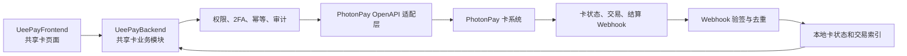

#  共享卡业务实施方案

## 1. 文档目标

本文档用于评审 UeePay 共享卡业务的产品边界、技术架构、接口集成、数据模型、安全控制、交付阶段和验收标准。

本文档仅描述实施方案，不包含代码修改、排期承诺或生产环境上线授权。

## 2. 参考与前提

- PhotonPay 卡管理接口文档：[https://api-doc1.uat.photontech.cc/#tag/卡管理](https://api-doc1.uat.photontech.cc/#tag/%E5%8D%A1%E7%AE%A1%E7%90%86)
- 本方案核对的文档版本：`2026-08-06`
- 实际可用能力以 PhotonPay 为 UeePay 商户开通的产品、BIN、币种和生产权限为准。
- 服务端是数据归属、权限、认证、风控、幂等、资金和卡状态的最终边界。

## 3. 已确认的 MVP 范围

### 3.1 包含范围

- 企业 USD 账户作为共享资金池。
- 仅支持虚拟共享卡。
- 企业管理员负责管理，员工通过现有团队账号查看和使用本人卡片。
- 每名员工分配独立卡片，项目或用途作为卡片标签，不多人共用同一套卡号、有效期和 CVV。
- 一张共享卡创建后永久绑定一名员工，不支持更换用卡人；其他员工需要用卡时重新开卡。
- 每张卡配置单笔、每日、每月和累计可交易额度。
- 管理员可开卡、调额、冻结、解冻、销卡、查看交易及查看授权后的卡片私密信息。
- 在现有“卡片管理”中新增“共享卡”页签。

### 3.2 首期不包含

- 员工自助开卡、调额、解冻、销卡和换绑。
- 开卡或调额申请审批流。
- 实体卡、收件人、物流、激活、PIN、补卡和挂失流程。
- EUR、GBP 或跨币种资金池。
- 多级组织、部门预算和 Matrix 子账户管理。
- 自建发卡账本或替代 PhotonPay 的资金与卡状态结果。

## 4. 可行性结论

该业务可实现。PhotonPay 已原生提供 `cardType=share` 的共享卡类型，并提供共享卡 BIN、开卡、结果查询、卡列表、卡详情、CVV 查询、额度更新、冻结、解冻、销卡、交易明细和 Webhook 通知等能力。

建议在现有 UeePay VCC 后端模块中增加 PhotonPay 共享卡适配层和本地业务记录，首期不拆分独立微服务。

## 5. 总体架构



### 5.1 架构原则

- UeePayFrontend 仅调用 UeePay 自有后端接口，不直接调用 PhotonPay。
- PhotonPay `appId`、`appSecret`、Token 和 RSA 私钥仅保存和使用于服务端。
- UeePayBackend 负责权限、2FA、参数校验、幂等、请求转换、Webhook 验签和操作审计。
- PhotonPay 是卡状态和实际交易结果的最终来源。
- 本地数据用于业务查询、审计、Webhook 去重和异常恢复，不自行构造资金或卡状态成功结果。

## 6. PhotonPay 接口映射

| 业务能力 | PhotonPay 接口 | 关键说明 |
| --- | --- | --- |
| 共享卡 BIN | `GET /vcc/openApi/v4/getCardBin` | 传入 `cardType=share`、`cardFormFactor=virtual_card`、`cardCurrency=USD` |
| 创建共享卡 | `POST /vcc/openApi/v4/openCard` | 使用唯一 `requestId`，不允许前端超时后自动重试 |
| 查询请求结果 | `GET /vcc/openApi/v4/getRequestResult` | 对开卡、更新和冻结等未知结果进行补查 |
| 卡列表 | `GET /vcc/openApi/v4/pagingVccCard` | 固定筛选 `cardType=share` |
| 卡详情 | `GET /vcc/openApi/v4/getCardDetail` | 转换为 UeePay 稳定字段契约 |
| CVV 查询 | `GET /vcc/openApi/v4/getCvv` | 仅服务端授权后临时返回 |
| 更新卡配置 | `POST /vcc/openApi/v4/updateCard` | 更新单笔、日、月和累计额度 |
| 冻结或解冻 | `POST /vcc/openApi/v4/freezeCard` | 通过 `freeze` 和 `unfreeze` 区分 |
| 销卡 | `POST /vcc/openApi/v4/cancelCard` | 危险操作，需要二次确认 |
| 交易列表 | `GET /vcc/openApi/v4/pagingVccTradeOrder` | 按卡、时间和交易状态查询 |
| 单笔交易 | `GET /vcc/openApi/v4/getVccTradeOrder` | 用于详情和对账补查 |

### 6.1 开卡关键字段

```text
cardType: share
cardFormFactor: virtual_card
cardCurrency: USD
transactionLimitType: limited
transactionLimit: 累计可交易额度
maxOnPercent: 单笔限额
maxOnDaily: 每日限额
maxOnMonthly: 每月限额
cardholderId: 用卡人
requestId: 唯一业务请求号
```

## 7. 后端实施方案

### 7.1 PhotonPay 适配层

统一封装：

- Token 获取、缓存和失效刷新。
- 请求体 RSA 签名。
- PhotonPay 请求和响应字段转换。
- 上游响应码与 UeePay 错误码转换。
- 超时、未知结果和最终状态查询。
- Webhook 验签、去重、乱序保护和日志脱敏。

禁止将密钥、Token、完整卡号、CVV、证件资料或完整上游报文写入日志。

### 7.2 本地数据模型

#### `shared_cards`

- UeePay 卡 ID。
- PhotonPay `cardId`。
- `cardholderId`。
- 团队账号 ID。
- BIN、币种和卡组织。
- 脱敏卡号。
- 卡昵称。
- 卡状态。
- 单笔、每日、每月和累计额度。
- 已用额度和剩余额度。
- 创建时间和更新时间。

不保存完整 PAN 和 CVV。

#### `shared_card_requests`

- `requestId`。
- 操作类型：开卡、调额、冻结、解冻、销卡。
- 目标卡 ID。
- 请求状态：处理中、成功、失败或结果未知。
- 上游响应码。
- 补查次数。
- 最终确认时间。

#### `shared_card_transactions`

- PhotonPay 交易 ID。
- 卡 ID。
- 交易类型和状态。
- 授权金额、结算金额和币种。
- 商户名称和交易时间。
- 交易发起类型。
- Webhook 版本和最后更新时间。

金额使用定点小数类型，不使用 JavaScript 浮点数进行资金计算。

#### `shared_card_abnormal_reports`

- 报告 ID、企业 ID、团队账号 ID、卡 ID 和交易 ID。
- 员工提交的业务说明和脱敏附件引用。
- 处理状态、管理员或运营处理人、处理时间和结果。
- 是否已转为正式争议及关联争议 ID。

#### `shared_card_disputes`

- PhotonPay 争议 ID、卡 ID、交易 ID 和关联员工。
- 争议金额、费用、币种、原因和状态。
- 证据要求、提交截止时间和上游提交结果。
- 准备金占用、最终裁决和完成时间。

#### `shared_card_audit_logs`

- 操作管理员。
- 操作类型。
- 卡 ID。
- 调额前后值。
- 操作时间。
- `requestId`。
- 成功或失败结果。

审计日志不记录完整卡号、CVV、Token、证件资料和请求原文。

### 7.3 UeePay 内部接口建议

```text
GET  /vcc/shared/bins
GET  /vcc/shared/cards
POST /vcc/shared/cards
GET  /vcc/shared/cards/{id}
POST /vcc/shared/cards/{id}/limits
POST /vcc/shared/cards/{id}/freeze
POST /vcc/shared/cards/{id}/unfreeze
POST /vcc/shared/cards/{id}/cancel
POST /vcc/shared/cards/{id}/private
GET  /vcc/shared/cards/{id}/transactions
GET  /vcc/shared/statistics

GET  /vcc/shared/my/cards
GET  /vcc/shared/my/cards/{id}
POST /vcc/shared/my/cards/{id}/private
POST /vcc/shared/my/cards/{id}/freeze
POST /vcc/shared/my/cards/{id}/abnormal-report

GET  /vcc/shared/disputes
GET  /vcc/shared/disputes/{id}
POST /vcc/shared/disputes/{id}/evidence
POST /vcc/shared/disputes/{id}/submit
```

前端使用 UeePay 自有稳定契约，由后端完成 PhotonPay 字段、枚举、错误码和状态转换。

### 7.4 开卡流程

1. 校验管理员权限、企业认证和 USD 账户状态。
2. 查询并校验共享虚拟卡 BIN。
3. 校验用卡人和额度。
4. 服务端生成唯一 `requestId`。
5. 先保存“处理中”请求记录，再调用 PhotonPay。
6. 同步成功时保存卡片；同步失败时保存明确失败结果。
7. 超时或结果未知时不再次开卡，使用原 `requestId` 查询最终结果。
8. Webhook 到达后再次校正本地状态。
9. 前端对未知结果显示“处理中”，不允许立即重复开卡。

### 7.5 额度规则

一张共享卡实际可消费额度由以下条件共同决定：

```text
企业 USD 资金池可用余额
累计剩余额度
当日剩余额度
当月剩余额度
单笔限额
上游及风控允许额度
```

- 累计额度是卡片消费上限，不代表从企业资金池预留了对应资金。
- 多张卡共同竞争企业账户的实际可用余额。
- 增加和减少额度均生成独立 `requestId`。
- 调额处理中禁止重复提交。
- 上游结果未知时显示处理中，不得当作失败后立即重试。
- 已销卡不允许增加额度。
- 调额前后值必须进入审计日志。

### 7.6 Webhook 和对账

建议接入：

- 卡状态通知。
- 发卡交易通知。
- 发卡交易结算通知。
- 用卡人审核状态通知（如共享卡使用独立用卡人）。
- 争议创建、证据要求、裁决和关闭通知。
- UeePay 团队账号暂停、移除和联系方式变更事件。

处理要求：

- 验签成功后才允许更新业务数据。
- 按事件 ID、交易 ID 和事件类型去重。
- 重复通知不能重复生成交易或重复扣减统计。
- 乱序通知使用状态优先级或上游更新时间处理，终态不得回退。
- 定时补查长时间停留在处理中的请求。
- 每日对账卡状态、额度和交易，差异进入告警和人工处理，不由前端自行修正。

### 7.7 团队账号和员工用卡

- 管理员只能选择本企业有效团队账号；缺少 PhotonPay 用卡人映射时，先向员工发起资料和持卡人协议确认任务。
- 员工通过本人团队账号补充上游必要资料并确认协议，服务端记录协议版本、确认时间和上游审核结果。
- 只有 PhotonPay 用卡人状态明确为可用后，才能建立团队账号与 `cardholderId` 的唯一映射并允许开卡。
- 员工接口只从登录态解析团队账号和本人卡片，不接受前端指定其他员工 ID。
- 员工查看 PAN、有效期和 CVV 时复用统一 2FA，返回结果仅存在于当前组件局部内存。
- 3DS 发送到当前团队账号已验证的手机号或邮箱；上游不能满足该要求时，员工卡功能不得上线。
- 团队账号暂停、移除或离职事件必须先撤销私密信息和 3DS 权限，再自动冻结关联共享卡并通知管理员销卡。
- 员工只能冻结本人卡，不能解冻、调额、销卡、开卡、换绑、查看企业余额或访问其他员工卡片。
- 异常交易报告先冻结本人卡并创建人工处理记录，不直接等同于正式拒付。

### 7.8 拒付和争议

- PhotonPay 争议事件按争议 ID 去重，并关联原交易、卡片、企业和员工。
- 服务端记录证据要求、截止时间、提交状态、裁决状态、拒付本金和费用。
- 员工可以补充本人交易说明或凭证，企业管理员或运营负责正式提交。
- 胜诉释放对应准备金；败诉记入企业负债，余额不足时触发提现限制、卡片限制和补足资金流程。
- 上游没有争议 API 时，必须定义受控的运营工单和人工提交渠道，不允许只依赖聊天或普通邮件留痕。

## 8. 前端实施方案

### 8.1 产品入口

在现有卡片管理内形成以下信息架构：

```text
常规卡 | 共享卡 | 开卡记录 | 卡片账单
```

共享卡页签使用独立查询契约，不改变现有常规卡的转入、转出、开卡和详情逻辑。

### 8.2 共享卡概览

建议展示：

- USD 资金池可用余额。
- 共享卡总数。
- 正常卡数量。
- 冻结卡数量。
- 本月消费金额。

不将所有卡的累计额度简单表达为“已冻结资金”或“已占用资金”。

### 8.3 共享卡列表

建议字段：

- 脱敏卡号。
- 卡昵称。
- 用卡人名称。
- 项目或用途。
- 卡状态。
- 累计额度和剩余额度。
- 单笔、每日和每月限额。
- 本月消费。
- 创建时间。

建议操作：

- 查看详情。
- 调整额度。
- 冻结或解冻。
- 销卡。

共享卡不显示常规卡的“转入”和“转出”按钮。

### 8.4 共享卡开卡

表单建议包含：

- 共享虚拟卡 BIN。
- 用卡人。
- 项目或用途。
- 卡昵称。
- 累计额度。
- 单笔限额。
- 每日限额。
- 每月限额。

提交前明确告知：

- 卡币种为 USD。
- 资金来自企业共享余额。
- 卡片额度不等于已预留资金。
- 开卡处理中不得重复提交。

### 8.5 共享卡详情

页面包含：

- 卡片概览。
- 额度配置。
- 用卡人和团队账号脱敏信息。
- 交易记录。
- 操作审计。

完整卡号、有效期和 CVV 的展示规则：

- 默认仅显示脱敏信息。
- 必须由管理员主动点击查看。
- 复用项目统一 2FA 流程。
- 服务端完成权限和认证后临时返回。
- 页面隐藏、关闭、请求失败或组件卸载时清理。
- 不进入 Pinia 持久化、URL、日志、埋点或错误上报。

### 8.6 员工“我的共享卡”

员工团队账号页面包含：

- 本人卡片的脱敏卡号、状态、额度和本人交易。
- 2FA 后临时查看本人 PAN、有效期和 CVV。
- 冻结本人卡和提交异常交易报告。
- 本人交易、3DS、订阅失败、冻结和销卡通知。

员工接口必须从当前登录态解析团队账号和卡片归属，不接受前端传入其他员工 ID。员工不能开卡、调额、解冻、销卡、查看企业余额或访问其他员工卡片。

## 9. 状态模型

建议 UeePay 内部契约统一使用以下状态，由后端映射 PhotonPay 原始状态：

| 状态码 | 中文名称 | English name | 处理规则 |
| --- | --- | --- | --- |
| `creating` | 创建中 | Creating | 开卡请求已提交，等待同步或异步结果 |
| `pending` | 处理中 | Pending | 上游已受理但未返回最终结果 |
| `normal` | 正常 | Active | 卡片可按额度和风控规则正常使用 |
| `freezing` | 冻结中 | Freezing | 冻结请求处理中，禁止重复操作 |
| `frozen` | 已冻结 | Frozen | 管理员冻结，允许按权限发起解冻 |
| `risk_frozen` | 风控冻结 | Frozen by Risk Control | 由风控触发，不允许前端直接解冻 |
| `system_frozen` | 系统冻结 | Frozen by System | 由系统或上游触发，不允许前端直接解冻 |
| `unfreezing` | 解冻中 | Unfreezing | 解冻请求处理中，禁止重复操作 |
| `canceling` | 销卡中 | Cancelling | 销卡请求处理中，禁止其他卡状态操作 |
| `cancelled` | 已销卡 | Cancelled | 终态，不允许恢复或调增额度 |
| `expired` | 已过期 | Expired | 卡片过期，不允许继续交易 |
| `failed` | 处理失败 | Failed | 请求已确认失败，页面显示服务端提供的安全错误信息 |

- `pending`、`freezing`、`unfreezing` 和 `canceling` 显示处理中并禁止重复操作。
- `risk_frozen` 和 `system_frozen` 不允许管理员从前端直接绕过。
- `cancelled` 是终态。
- 未知上游状态统一显示为“未知状态 / Unknown status”，不得默认映射为成功或正常。

团队账号联动状态：

| 状态码 | 中文名称 | English name | 共享卡处理规则 |
| --- | --- | --- | --- |
| `active` | 正常 | Active | 员工可以按权限查看和使用本人卡片 |
| `suspended` | 已暂停 | Suspended | 撤销私密信息和 3DS 权限，自动冻结关联卡片 |
| `removed` | 已移除 | Removed | 撤销全部访问，自动冻结关联卡片并通知管理员销卡 |

## 10. 安全与合规

### 10.1 数据分级

- 姓名、邮箱、手机号、地址：Personal。
- Token、证件号、KYC 文件：Sensitive。
- 完整 PAN、CVV、PIN、私钥：Restricted。

### 10.2 控制要求

- 服务端校验数据归属、管理员权限、员工团队账号、卡片归属、认证、风控和地区限制。
- 开卡、调额、冻结、解冻和销卡必须防重复提交，不得开启客户端超时自动重试。
- 危险操作必须二次确认；是否额外触发 2FA 由服务端策略决定。
- 完整 PAN 和 CVV 仅在明确的临时查看流程中存在，不持久化。
- 前端隐藏按钮不代表服务端授权。
- 不记录请求头、完整请求体、完整响应体、Cookie、Token、PAN、CVV 和证件资料。

## 11. 实施阶段和工期估算

以 1 名后端、1 名前端和 1 名测试并行实施估算，包含员工团队账号用卡、3DS、异常报告和争议流程的 MVP 约需 7～10 周。本估算不包含 PhotonPay 商户开通、合规审批或外部协调等待时间。

### 阶段 0：上游能力确认，2～3 个工作日

- 确认 UAT 和生产环境共享卡权限。
- 确认可用 USD 虚拟共享卡 BIN。
- 确认共享卡与 USD 账户的绑定方式。
- 确认开卡时 `accountId`、`rechargeAmount` 和 `arrivalAmount` 的实际传值规则。
- 确认调额、冻结、销卡和 Webhook 的实际状态变化。
- 确认卡片冻结或销卡后，未结算交易、退款和争议仍能继续入账和追踪。
- 确认团队账号与 `cardholderId` 的资料、协议、审核和禁用规则。
- 确认员工 3DS 联系方式、争议证据、裁决状态、费用和截止时间。

完成标准：在 UAT 使用测试账户手工跑通一张小额度共享卡的完整链路。

### 阶段 1：接口和数据契约，3～5 个工作日

- 定义 UeePay 内部 API。
- 定义本地数据表。
- 完成字段、状态和错误码映射。
- 确定权限、2FA、幂等和审计规则。
- 准备脱敏 UAT 测试数据。

完成标准：前后端接口契约、状态机和错误码评审通过。

### 阶段 2：后端核心能力，7～10 个工作日

- PhotonPay 适配层。
- BIN 查询。
- 开卡与请求结果查询。
- 卡列表和详情。
- 调额、冻结、解冻和销卡。
- 卡片私密信息临时查询。
- 团队账号与 `cardholderId` 映射、员工本人卡授权、账号禁用自动冻结。
- 异常交易报告、争议记录、权限、幂等、防重复提交和审计。

完成标准：接口测试覆盖正常、失败、超时、重复提交和结果未知场景。

### 阶段 3：Webhook 和交易同步，4～6 个工作日

- Webhook 验签。
- 通知去重和乱序保护。
- 卡状态同步。
- 授权和结算交易同步。
- 未知请求补查。
- 每日差异对账和告警。

完成标准：重复、乱序和延迟通知不会造成重复交易、重复统计或状态倒退。

### 阶段 4：前端页面，5～7 个工作日

- 共享卡页签。
- 共享卡概览和列表。
- 开卡页面。
- 调额和卡状态操作。
- 卡详情和交易记录。
- 员工“我的共享卡”、2FA 查看、本人卡冻结和异常交易报告。
- 管理员争议列表、证据提交和截止时间提醒。
- 卡片私密信息展示和生命周期清理。
- 多语言和移动端适配。

完成标准：管理员可完成开卡、查卡、调额、冻结、解冻、销卡、争议和交易查询闭环；员工只能完成本人卡查看、使用、冻结和异常报告。

### 阶段 5：UAT 和灰度，5～7 个工作日

- 小额度真实链路测试。
- 权限和 2FA 测试。
- 团队账号本人卡访问、3DS、账号禁用自动冻结和越权测试。
- 订阅失败、退款、拒付证据和裁决状态测试。
- 并发和重复提交测试。
- Webhook 故障和补偿测试。
- 卡状态、额度和交易对账。
- 安全日志检查。
- 桌面端和移动端回归。

完成标准：先对白名单企业开放，首批限制卡数量和单卡额度，稳定后再扩大范围。

## 12. 验收标准

- 仅能查询和创建 `share + virtual_card + USD` 卡。
- 连续点击、客户端超时或页面重新进入不会重复开卡。
- 开卡结果未知时可以使用原 `requestId` 恢复最终结果。
- 单笔、日、月和累计额度能正确展示和更新。
- 冻结后卡片不能继续正常操作。
- 销卡需要二次确认，销卡后不能恢复或调增额度。
- 一张卡创建后永久绑定一名员工，接口和页面均不提供换绑能力。
- 员工只能查看本人卡，2FA 后临时查看私密信息，并能冻结本人卡和提交异常报告。
- 团队账号禁用或移除后，员工访问立即撤销且关联卡片自动冻结。
- 3DS 只发送到当前员工团队账号已验证的联系方式。
- 拒付证据、截止时间、提交结果、裁决和准备金记账可以完整追踪。
- Webhook 重复通知不会生成重复交易。
- Webhook 乱序不会使终态回退。
- 卡列表和普通详情不返回完整 PAN 和 CVV。
- 私密信息查看必须经过服务端权限和 2FA。
- 完整 PAN 和 CVV 不进入 Store、URL、日志、埋点和持久化存储。
- PhotonPay 密钥、Token 和签名逻辑不进入前端。
- 上游不可用时，界面展示真实的处理中或失败状态，不伪造成功。
- 常规卡列表、开卡、转入、转出、详情和账单功能不受共享卡上线影响。

## 13. 上线和回滚

### 13.1 上线策略

1. 使用后端企业白名单或功能开关控制共享卡入口。
2. UAT 完成后先向内部测试企业开放。
3. 首批限制企业可开卡数、单卡累计额度、单笔限额和日限额。
4. 监控开卡成功率、未知请求数、Webhook 延迟、对账差异和冻结失败。
5. 稳定后再扩大企业范围和额度。

### 13.2 回滚策略

- 关闭共享卡前端入口和新建卡权限。
- 保留已创建共享卡的详情、冻结、销卡和交易查询能力，避免已发卡片失管。
- 不删除本地幂等记录、Webhook 记录和审计日志。
- 继续接收 Webhook 并完成对账，直至所有存量卡已处理完毕。

## 14. 主要风险与待确认事项

| 风险或待确认项 | 影响 | 建议措施 |
| --- | --- | --- |
| 商户未开通共享卡或生产 BIN | 无法开卡 | 在阶段 0 取得 PhotonPay 书面确认并完成 UAT 开卡 |
| `accountId` 和共享资金池绑定语义不清晰 | 可能发生错误资金路径 | 按实际商户账户做最小金额 UAT 验证 |
| 共享额度被误解为资金预留 | 余额展示和财务预期错误 | 产品文案明确区分资金池余额和卡片可交易额度 |
| 非幂等操作超时后重复请求 | 重复开卡或重复变更 | 服务端唯一 `requestId` + 处理中记录 + 最终结果补查 |
| Webhook 重复、延迟或乱序 | 重复交易或状态回退 | 验签、去重、状态优先级、主动补查和每日对账 |
| PAN 和 CVV 暴露 | 合规和安全风险 | 服务端授权、2FA、短生命周期和禁止日志与持久化 |
| 员工越权访问其他卡片 | 泄露卡片和交易数据 | 员工接口只从登录态解析本人归属，不接受前端指定员工 ID |
| 团队账号失效但卡片仍可用 | 离职员工继续消费 | 账号禁用事件触发权限撤销和卡片自动冻结 |
| 3DS 联系方式无法绑定员工 | 员工无法完成线上交易 | 上线前确认 PhotonPay 联系方式和验证通道，不满足则阻塞员工卡上线 |
| 拒付证据或准备金规则未确认 | 逾期败诉或形成负余额 | 与 PhotonPay、资金、风控和法务确认接口、时限、费用和准备金策略 |
| 上游状态和现有数字状态不一致 | 共享卡显示错误或影响常规卡 | 共享卡使用独立稳定状态契约，后端统一映射 |
| 共享卡修改侵入现有常规卡 | 存量业务回归 | 独立页签、独立接口契约、复用通用组件但不共用业务状态 |

## 15. 实施前准入条件

以下条件全部满足后再进入开发：

- PhotonPay 已确认 UAT 和生产共享卡权限。
- 已取得可用的 USD 虚拟共享卡 BIN。
- 已验证企业 USD 账户与共享卡的资金路径。
- 已确认开卡和调额字段规则。
- 已获取 Webhook 事件样例和验签规则。
- 已确认管理员、员工团队账号权限和私密卡信息 2FA 策略。
- 已验证团队账号与 `cardholderId` 映射、3DS 联系方式、账号禁用自动冻结和越权拦截。
- 已确认争议证据提交渠道、截止时间、费用、准备金和负余额追偿规则。
- 已通过产品、后端、前端、测试、安全和运营联合评审。
